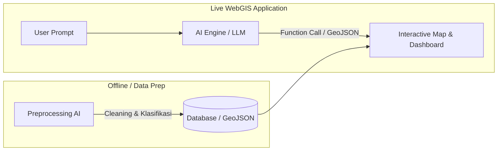
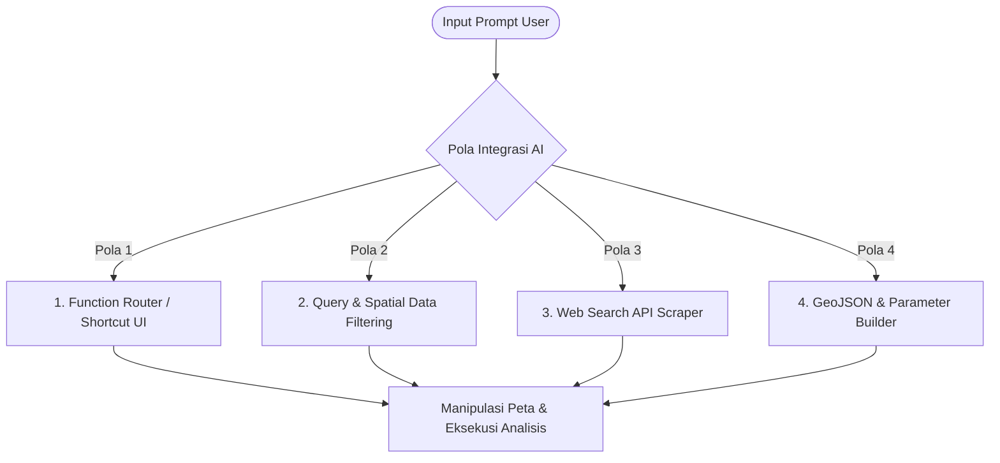

# Notulensi Coaching 2: Ekspektasi & Pemanfaatan AI dalam WebGIS
**MAPID WebGIS Competition 2026**

---

| Parameter | Keterangan |
| :--- | :--- |
| **Topik** | Coaching 2: Implementasi, Arsitektur, & Ekspektasi AI pada WebGIS |
| **Narasumber** | Mas Mahrus (Tech & Engineering Lead MAPID) |
| **Moderator / MC** | Esya Aprisali Putri |
| **Sasaran** | Top 50 Tim Terkurasi MAPID WebGIS Competition 2026 |
| **Fokus Utama** | Integrasi AI Interaktif (User-Facing), Structured Output, Function Routing, & Keamanan |

---

## 1. Kebijakan & Ekspektasi Utama AI dari Panitia

### 1.1 Penyediaan API Key & Kuota AI
* **Mandiri (Tidak Disediakan Panitia)**: MAPID **tidak menyediakan API key atau kuota token AI** (seperti OpenAI, Claude, dll.).
* **Rekomendasi Alternatif**: Tim dibebaskan menggunakan API berbayar mandiri atau memanfaatkan *free tier / open-source API* (misalnya: *Google Gemini API free tier*, *Groq*, *OpenRouter*, *HuggingFace Inference API*, dll.).

### 1.2 Posisi AI: Preprocessing vs User-Facing WebGIS

* **AI Preprocessing (Offline)**: Penggunaan AI untuk *data cleaning*, klasifikasi foto survei offline, atau labeling data diperbolehkan, namun memiliki visibilitas rendah bagi juri.
* **AI User-Facing (Front-end / Interaktif)**: **Sangat ditekankan dan memiliki bobot penilaian utama**. AI yang menempel langsung pada aplikasi WebGIS (berinteraksi dengan pengguna, memanipulasi tampilan layer peta, memfilter data, atau mengeksekusi analisis spasial) adalah yang dinilai secara langsung oleh dewan juri.

---

## 2. Pola Arsitektur & Prinsip Integrasi AI

### 2.1 Format Pemisahan Output (*Structured Output vs Narrative Response*)
Aplikasi WebGIS membutuhkan data yang terstruktur dan deterministik (koordinat, format GeoJSON, atau parameter filter). Oleh karena itu, response dari LLM wajib dipisahkan menjadi dua bagian:

$$\text{AI Response} = \begin{cases} \mathbf{JSON\ Response} & \text{(Data terstruktur untuk manipulasi peta \& eksekusi fungsi)} \\ \mathbf{Text\ Response} & \text{(Penjelasan naratif/konfirmasi human-readable kepada user)} \end{cases}$$

```json
{
  "action": "filter_layer",
  "target_layer": "infrastruktur_jembatan",
  "query_filter": {"kondisi": ["rusak_berat", "rusak_ringan"]},
  "text_response": "Menampilkan 12 titik jembatan dengan kondisi rusak di wilayah analisis."
}
```

---

## 3. Ragam Pola Penerapan (*Use Cases*) AI dalam WebGIS



### 3.1 Pola 1: AI sebagai *Function Router* (*Trigger Function by Name*)
* **Konsep**: Menggunakan AI sebagai *shortcut* pengganti navigasi UI yang kompleks. User mengetikkan instruksi bahasa alami, dan AI memilih fungsi geospasial yang tepat untuk dieksekusi oleh backend/frontend.
* **Contoh**:
  * *Prompt*: *"Tolong buatkan radius jangkauan 500 meter dari titik ini"* $\rightarrow$ AI memilih fungsi `buffer_analysis(radius=500)`.
  * *Prompt*: *"Hitung rute tercepat antar stasiun"* $\rightarrow$ AI memilih fungsi `calculate_route(origin, destination)`.
* **Kelebihan**: Sangat stabil dan minim kesalahan (*deterministic*), karena kalkulasi spasial tetap dijalankan oleh *code engine* WebGIS (Turf.js / PostGIS / Python), bukan dihitung secara manual oleh LLM.

### 3.2 Pola 2: AI untuk *Filtering* & Manipulasi Data Spasial
* **Konsep**: AI menerjemahkan permintaan natural language menjadi parameter penyaring data tabel / atribut GeoJSON.
* **Contoh Kasus**:
  * *Prompt*: *"Tampilkan jembatan yang kondisinya rusak"* $\rightarrow$ AI menyaring atribut `rusak_berat` dan `rusak_ringan`.
  * *Prompt*: *"Urutkan fasilitas dari yang paling dekat"* $\rightarrow$ AI mengurutkan array data berdasarkan nilai `jarak_meter` terendah.
* > [!WARNING]
  > **Mitigasi Token Limit**: Jangan melempar seluruh *raw dataset* yang berukuran besar ke dalam prompt LLM karena akan memboroskan kuota token dan berisiko *token limit exceeded*. **Best Practice**: Minta AI menghasilkan **query filter / kriteria JSON**, lalu lakukan filtering data secara lokal di sisi client/backend.

### 3.3 Pola 3: Integrasi *Web Search API* untuk Data Eksternal Dinamis
* **Konsep**: Menggabungkan LLM dengan API pencarian web (misal: SerpAPI, Tavily, Google Search API) untuk memperkaya data WebGIS secara *real-time*.
* **Contoh Kasus**:
  * *Prompt*: *"Tunjukkan sebaran kasus begal terbaru di Bandung, berikan pendekatan koordinat dan tanggal kejadiannya"*.
  * LLM men-scrapping berita terkini, mengekstrak entitas lokasi/waktu, dan menyusunnya menjadi format `FeatureCollection` (GeoJSON).
* **Catatan Teknis**: Selalu lakukan validasi di frontend terhadap hasil koordinat dari web search (tangani kasus jika koordinat bernilai `null` atau `[0, 0]`).

### 3.4 Pola 4: Pembuatan Geometri Spasial & Keterbatasan LLM
* LLM dapat diminta menghasilkan objek GeoJSON (Point, Polygon, Circle, H3 Grid) secara langsung.
* **Keterbatasan Spasial LLM**: LLM murni sering mengalami halusinasi saat menghitung koordinat matematis vertex poligon kompleks (misal orientasi heksagon terbalik atau koordinat meleset ke laut).
* **Solusi Rekomendasi**: Gunakan AI hanya untuk mengekstrak parameter (koordinat titik pusat $lat, long$ dan nilai radius $r$), kemudian gunakan library geospasial (*Turf.js*, *H3-js*, atau *Shapely*) untuk menggambar geometrinya secara presisi.

---

## 4. Studi Kasus Sukses (*Success Stories*) AI di GeoMAPID

Mas Mahrus membagikan 3 implementasi nyata AI yang telah beroperasi di platform GeoMAPID:

| No | Fitur GeoMAPID | Cara Kerja & Peran AI | Output yang Dihasilkan |
| :---: | :--- | :--- | :--- |
| **1** | **Site Analysis Assistant** | Menggabungkan data agregat demografi, kebencanaan, dan *people spending* di peta dengan prompt pertanyaan bisnis user. | Rekomendasi naratif (misal: penetapan estimasi harga menu coffee shop berbasis daya beli warga sekitar). |
| **2** | **MCDA Formula Generator (Site Selection)** | Membantu user menyusun formula pembobotan analisis kesesuaian lokasi multi-kriteria (*Multi-Criteria Decision Analysis*) tanpa harus mengatur puluhan parameter POI manual dari nol. | Daftar bobot parameter POI & demografi (misal: bobot negatif untuk kanibalisme brand sendiri, bobot positif untuk kompetitor & target audiens). |
| **3** | **Natural Language Layer Styler** | Mengubah perintah teks bebas (*"Warnai poligon kecamatan berdasarkan kolom kepadatan dengan gradasi ungu ke kuning"*) menjadi konfigurasi visual peta tematik. | JSON konfigurasi style layer (*choropleth rules*) yang langsung di-render ke peta dan disimpan ke database. |

---

## 5. Rangkuman Sesi Q&A & Poin Penilaian Dewan Juri

### Q1: Bagaimana dengan keamanan AI (*Prompt Injection, Prompt Tempering*, & Kebocoran API Key)?
> **Tanggapan Mas Mahrus**:
> * **Keamanan API Key (Wajib)**: API Key AI **tidak boleh terekspos di front-end/client-side**. Seluruh panggilan API ke AI wajib melalui proxy backend (Express, FastAPI, Next.js API Routes) dengan variabel lingkungan (`.env`).
> * **Pengujian Dewan Juri**: Dewan juri akan menguji sistem dalam batas penggunaan wajar (*functional assessment*).
> * **Poin Penilaian (Success Rate)**: *Success rate* respon AI terhadap fungsi WebGIS merupakan indikator penilaian penting.
> * **Tips Strategis untuk PRD**: Pada dokumen PRD dan panduan aplikasi, tim disarankan menyertakan **daftar rekomendasi contoh prompt (*curated prompts*)** yang memiliki tingkat keberhasilan (*success rate*) tertinggi untuk memandu dewan juri saat penilaian.

### Q2: Berapa batas limit request API MAPID (RPM, TPM, RPD)?
> **Tanggapan Mas Mahrus**:
> * Limit request diberlakukan panitia demi stabilitas dan keamanan server MAPID.
> * Spesifikasi teknis limit (*Request Per Minute / Day*) akan diumumkan lebih lanjut oleh tim panitia melalui grup koordinasi peserta.

### Q3: Sejauh mana parameter validasi & verifikasi output AI yang dinilai juri?
> **Tanggapan Mas Mahrus**:
> * Juri menilai **seberapa kreatif dan presisi tim dalam membatasi (*guardrails*) dan memverifikasi output AI**.
> * AI yang dibiarkan menghasilkan output bebas tanpa kontrol skema rentan melenceng (misal menggambar koordinat di laut).
> * **Strategi Verifikasi Efektif**:
>   1. Gunakan *Strict JSON Schema / Structured Outputs*.
>   2. Posisikan AI sebagai *parameter generator / query builder*, bukan kalkulator koordinat mentah.
>   3. Terapkan validasi *bounding box* di frontend sebelum me-render data ke peta.

---

## 6. Panduan Praktis & Checklist Pengembangan AI WebGIS

- [x] **Arsitektur Backend**: Simpan API key AI di server backend; jangan pernah hardcode token di frontend.
- [x] **Pemisahan Output**: Pastikan respons AI memisahkan `json_response` (eksekusi sistem) dan `text_response` (narasi pengguna).
- [x] **Hybrid Spatial Calculation**: Manfaatkan AI untuk menangkap *user intent*, lalu serahkan kalkulasi geometri spasial (buffer, polygon, isochrone) ke engine GIS (*Turf.js*, *PostGIS*, *Geopandas*).
- [x] **Optimasi Kuota Token**: Jangan kirim raw dataset masif ke prompt; instruksikan AI menghasilkan query filter atau aggregasi ringkas.
- [x] **Prompt Presets di UI / PRD**: Sediakan tombol *quick prompt* atau daftar contoh instruksi di UI WebGIS untuk mempermudah juri dan pengguna.
- [x] **Error Handling & Fallback**: Sediakan penanganan error jika output AI mengembalikan koordinat `0,0`, format JSON rusak, atau rate limit tercapai.
