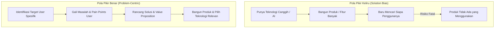
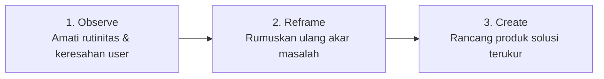
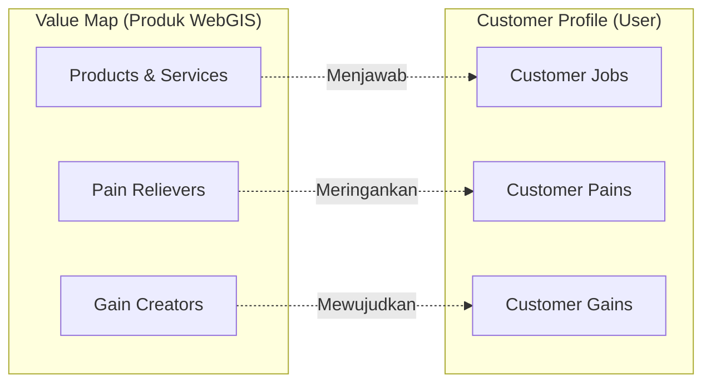

# Notulensi Coaching 3: Industry Demand, Market Insight, & Value Proposition
**MAPID WebGIS Competition 2026**

---

| Parameter | Keterangan |
| :--- | :--- |
| **Topik** | Coaching 3: Industri Demand, Market Insight, & Value-Driven Product Design |
| **Narasumber** | Bapak Widya Sena Pradipta (VP Property Project Development PT KAI / Juri MAPID Catalyst 2025) |
| **Moderator / MC** | Devina |
| **Sasaran** | Top 50 Tim Terkurasi MAPID WebGIS Competition 2026 |
| **Fokus Utama** | Menghindari *Solution Bias*, Menemukan *Core Value*, Pemetaan *Value Proposition Canvas* (VPC), dan Prioritisasi Fitur Solutif |

---

## 1. Paradigma Produk: Mengapa Produk Hebat Belum Tentu Dipakai?

### 1.1 Definisi Produk yang Bagus: Kebutuhan User vs Spesifikasi Fitur
* **Miskonsepsi Inovator**: Produk bagus kerap diartikan sebagai produk yang paling canggih, unik, memiliki fitur AI berlimpah, komputasi cepat, dan desain visual futuristik.
* **Realitas Pasar & Industri**: **Produk yang baik bukanlah produk yang paling canggih atau memiliki fitur terbanyak, melainkan produk yang paling dibutuhkan dan menyelesaikan masalah nyata pengguna (*User-Centric*)**.
* Nilai (*value*) sebuah produk dinilai dari kemampuannya menjawab permasalahan spesifik pengguna, bukan dari kompleksitas teknologi yang disematkan.

### 1.2 Studi Kasus Komparasi Produk Unggul
Membedah faktor keberhasilan produk global yang berhasil mendominasi pasar meskipun bukan pionir pertama:

* **Google vs Yahoo (Fokus Langsung ke Masalah)**:
  * Yahoo menyajikan tampilan beranda penuh portal berita (politik, olahraga, dll.) sehingga fungsi pencarian terdistraksi.
  * Google menyederhanakan antarmuka hanya dengan satu kotak pencarian (*to the point*), langsung menyelesaikan masalah pengguna yang membutuhkan informasi cepat tanpa distraksi.
* **iPhone vs Android/Smartphone Spek (Menjual Solusi & Ekosistem)**:
  * Kompetitor kerap berfokus menjual angka spesifikasi teknis (RAM, megapiksel kamera, kapasitas baterai).
  * Apple tidak menjual spesifikasi mentah, melainkan kemudahan pemakaian (*user experience*), ekosistem perangkat yang terhubung secara mulus, dan keamanan data pengguna (*data security*).
* **Airbnb vs Hotel Konvensional (Fleksibilitas & Pemanfaatan Idle Asset)**:
  * Hotel konvensional kaku dengan paket layanan baku dan harga relatif tinggi terutama pada *peak season*.
  * Airbnb memanfaatkan aset properti menganggur (*idle assets*), memberikan fleksibilitas harga, serta menghadirkan pengalaman lokal (*local living experience*) yang otentik bagi wisatawan.
* **Gojek vs Ojek Pangkalan (Kepastian & Efisiensi Transaksi)**:
  * Ojek pangkalan menuntut calon penumpang mendatangi pangkalan fisik, melakukan tawar-menawar tanpa standar tarif, dan menghadapi rute yang belum tentu diketahui pengemudi.
  * Gojek mentransformasi layanan dengan penjemputan berbasis aplikasi, kepastian harga transparan, navigasi rute terintegrasi, dan kemudahan multi-layanan dalam satu aplikasi.

### 1.3 Bahaya *Solution Bias* bagi Pengembang Produk

* **Solution Bias**: Kecenderungan inovator/engineer yang terpesona pada teknologi yang dikuasainya, kemudian membuat produk terlebih dahulu baru mencari siapa target penggunanya.
* **Prinsip Utama**: Mulailah dari calon pengguna dan masalah nyata yang dihadapi, lalu rumuskan solusi dan pilih teknologi yang paling tepat untuk mengeksekusinya.

### 1.4 Pelajaran dari Kegagalan Inovasi (*Failure Stories*)
Asumsi internal tanpa mendengarkan pergeseran kebutuhan pengguna menjadi penyebab runtuhnya pemimpin pasar:
* **Kodak**: Menemukan teknologi kamera digital pada era 1970-an namun enggan mengembangkannya karena terlena dengan margin keuntungan penjualan film kimia analog. Kodak berasumsi bisnis mereka adalah menjual film, padahal pengguna sejatinya ingin *mengabadikan memori*.
* **Nokia**: Raja ponsel global era 1990–2000-an yang menganggap ponsel sebatas perangkat keras untuk komunikasi telepon dan SMS. Terlambat menyadari pergeseran kebutuhan konsumen terhadap ponsel sebagai komputer saku multifungsi.
* **BlackBerry (RIM)**: Menguasai lebih dari 50% pasar smartphone dunia pada tahun 2008–2010. Terjebak asumsi bahwa keyboard fisik QWERTY dan trackpad adalah kunci segalanya, hingga akhirnya tergeser oleh revolusi layar sentuh (*touchscreen*) dan ekosistem aplikasi iPhone.

---

## 2. Memahami Sudut Pandang Pengguna (*User POV*) & Menemukan *Core Value*

### 2.1 Konsep "Outcome/Value over Product" (Membeli Hasil, Bukan Alat)
Pengguna pada hakikatnya tidak membeli produk atau alat fisik, melainkan membeli hasil (*outcome*) atau solusi atas permasalahannya:

$$\text{Core Value} = \mathbf{Hasil\ / \ Solusi\ yang\ Dirasakan\ User}\quad (\text{Bukan Alat\ / \ Fiturnya})$$

1. **Analogi Bor vs Lubang di Dinding**: Pengguna sebenarnya tidak membutuhkan mesin bor, melainkan **lubang di dinding** untuk memasang rak atau lemari.
2. **Analogi Kamera vs Mengabadikan Momen**: Nilai utama yang dicari pengguna adalah **mengabadikan momen**. Jika smartphone mampu melakukannya dengan praktis dan berkualitas, kebutuhan membeli kamera khusus menjadi berkurang.
3. **Analogi WebGIS vs Pengambilan Keputusan Manajer Aset**:
   * Manajer aset memiliki masalah data tersebar yang membutuhkan waktu **3 hari** untuk menyusun laporan rekapitulasi.
   * Kebutuhan esensial manajer aset adalah **mengambil keputusan strategis dalam waktu kurang dari 30 menit**.
   * WebGIS dengan segala kecanggihan teknisnya hanyalah instrumen pendukung (*enabler*); *core value*-nya terletak pada **akselerasi keputusan strategis < 30 menit**.

### 2.2 Simulasi Penjualan Berbasis Value (*The Umbrella Sales Pitch*)
Menawarkan produk tanpa menyebutkan fitur fisik produk (bisa dilipat, warna-warni, bahan tahan air), melainkan fokus pada *value* spesifik persona:
* **Persona 1: Pedagang Kaki Lima / Pedagang Keliling**:
  * *Value Pitch*: Menjaga barang dagangan tetap terlindungi dari sengatan matahari dan hujan deras agar komoditas tidak rusak dan aktivitas berjualan tetap berjalan lancar sepanjang hari.
* **Persona 2: Fotografer**:
  * *Value Pitch*: Membantu meredam dan memantulkan pencahayaan berlebih agar hasil jepretan foto memiliki pencahayaan lembut, profesional, dan merata tanpa risiko *overexposure*.

---

## 3. Kerangka Kerja Solusi: *Design Thinking* & *Value Proposition Canvas* (VPC)

### 3.1 Pola Alur Berpikir: *Observe $\rightarrow$ Reframe $\rightarrow$ Create*

* **Studi Kasus Wisatawan**:
  * *Observasi Awal Terburu-buru*: Ingin langsung membuat peta interaktif seluruh objek wisata di suatu kota.
  * *Observasi Mendalam & Reframe*: Wisatawan sering kali bukan bingung mencari direktori tempat wisata, melainkan memiliki **keterbatasan waktu (misal hanya 2 jam)** dan bingung memilih destinasi yang terjangkau dalam durasi tersebut.
  * *Solusi Terarah (Create)*: Menyediakan fitur *Dynamic Travel Route* berbasis waktu tempuh dan analisis jangkauan isokron (*Isochrone Maps*).

#### Integrasi 5 Tahapan *Design Thinking*:
1. **Empathize**: Wawancara langsung dengan target user untuk memahami hambatan (*pain points*) dan alur kerja harian (*user journey*).
2. **Define (Reframe)**: Menemukan akar permasalahan inti dan menyusun hipotesis solusi.
3. **Ideate**: Mengeksplorasi ide-ide fitur yang secara langsung menjawab kebutuhan pengguna.
4. **Prototype (Create)**: Membangun prototipe aplikasi WebGIS (MVP).
5. **Test**: Menguji coba prototipe kepada target user dan melakukan iterasi perbaikan berdasarkan feedback.

### 3.2 Pemetaan *Value Proposition Canvas* (VPC)
Memastikan adanya keselarasan (*Fit*) antara profil target pengguna (*Customer Profile*) dengan nilai produk (*Value Map*):

| Komponen VPC | Definisi | Contoh Kasus (Gojek) | Contoh Kasus (WebGIS Aset KAI) |
| :--- | :--- | :--- | :--- |
| **Customer Jobs** | Tugas/pekerjaan yang ingin diselesaikan pengguna. | Bepergian dari titik A ke B, memesan makanan, mengirim barang. | Memantau sebaran aset tanah/bangunan, evaluasi nilai aset, menyusun laporan. |
| **Customer Pains** | Hambatan, rasa frustrasi, dan risiko yang dialami pengguna. | Macet, tawar-menawar tarif di pangkalan, bayar tunai ribet. | Data aset tersebar di file Excel terpisah, butuh 3 hari membuat laporan, risiko tumpang tindih. |
| **Customer Gains** | Harapan, kemudahan, dan keuntungan yang diinginkan. | Praktis, tarif pasti transparan, 1 aplikasi untuk semua kebutuhan. | Dashboard terpadu satu pintu, keputusan cepat < 30 menit, visualisasi sebaran spasial akurat. |
| **Products & Services** | Solusi/fitur yang dibangun oleh tim pengembang. | Layanan GoRide, GoFood, GoSend, dan GoPay. | Platform WebGIS Manajemen Aset Interaktif. |
| **Pain Relievers** | Mekanisme spesifik untuk meredakan kesulitan pengguna. | Driver menjemput ke lokasi, kalkulasi tarif otomatis di aplikasi. | Sentralisasi database spasial, filter layer otomatis, integrasi visualisasi kepemilikan. |
| **Gain Creators** | Mekanisme yang melipatgandakan keuntungan pengguna. | Pembayaran digital terintegrasi, promo, rating driver transparan. | Analisis kesesuaian lahan otomatis, ekspor laporan analitik spasial instan. |

---

## 4. Prioritisasi Fitur: Mengatasi Jebakan *Super-Apps* (*Feature vs Problem*)

### 4.1 Simulasi 9 Fitur WebGIS vs Kebutuhan Kepala Desa pada Bencana Banjir
Diberikan contoh platform WebGIS dengan 9 fitur canggih:
1. *AI Spatial Analysis*
2. *3D City Model*
3. *Drone Integration*
4. *Real-time Traffic*
5. *Satellite Imagery*
6. *Predictive Analytics*
7. *AR Mapping*
8. *Digital Twin*
9. *Automated Report*

* **Target User**: Kepala Desa yang bertugas menentukan lokasi posko pengungsian dan rute distribusi bantuan banjir secara darurat.
* **Hasil Analisis Prioritas**:
  * Untuk Kepala Desa, hanya diperlukan **3–4 fitur relevan** (misal: *AI Spatial Analysis*, *Predictive Analytics*, *Satellite Imagery*, dan *Automated Report*).
  * Fitur canggih lainnya seperti *3D City*, *AR Mapping*, atau *Digital Twin* justru memperlambat performa aplikasi dan tidak dibutuhkan dalam situasi tanggap darurat.

### 4.2 Prinsip Eliminasi Fitur (*Less is More*)
> [!IMPORTANT]
> **Banyaknya fitur tidak menjamin keunggulan sebuah produk**. Aplikasi dengan terlalu banyak fitur (*over-featured*) berisiko membingungkan pengguna dan mengaburkan *value* utama. Utamakan fitur yang secara langsung menyelesaikan masalah prioritas pengguna.

---

## 5. Challenge & 5 Pertanyaan Wajib untuk Peserta MAPID Catalyst 2026

Bapak Sena memberikan tantangan khusus kepada seluruh tim peserta untuk mengevaluasi produk WebGIS yang sedang dikembangkan:

### 5.1 Lima Pertanyaan Kunci Evaluasi Produk
1. **Siapa user spesifik produk Anda? (*Target User Persona*)**
   * Tentukan profil pengguna yang konkret (misalnya: *Manajer Akuisisi Lahan*, *Perencana Transportasi Dinas Perhubungan*), bukan kelompok umum yang bias.
2. **Pekerjaan apa yang sebenarnya ingin diselesaikan oleh user? (*Customer Jobs*)**
   * Identifikasi tugas utama yang rutin dijalankan oleh target pengguna.
3. **Apa rasa sakit (*pain point*) paling menyiksa yang dihadapi user? (*Pain Point*)**
   * Temukan kendala paling mendasar yang menghambat efisiensi kerja pengguna.
4. **Apa bukti nyata bahwa masalah tersebut benar-benar terjadi? (*Evidence of Problem*)**
   * Sertakan data empiris, hasil observasi, survei lapangan, atau studi kasus nyata.
5. **Apa nilai (*value*) yang berubah bagi user setelah solusi diberikan? (*Value Proposition & Impact*)**
   * Tunjukkan perubahan terukur sebelum vs sesudah menggunakan produk (misalnya efisiensi waktu dari 3 hari menjadi 30 menit).

### 5.2 Tantangan Eliminasi 50% Fitur & Menemukan 1 *Core Value*
> [!TIP]
> **Challenge Juri**: Jika produk tim Anda memiliki daftar fitur yang sangat banyak, **cobalah pangkas 50% fitur tersebut**. Pertahankan **1 fungsi inti (*core function*)** yang memberikan *value* tertinggi bagi pengguna dan pastikan fungsi tersebut berfungsi secara sempurna.

### 5.3 Tiga Prinsip Emas Inovasi (*Golden Rules of Innovation*)
1. **Start with the people, not the technology**: Awali dari manusianya/penggunanya, bukan dari teknologinya.
2. **Don't ask what product they want, ask what problem they need to solve**: Jangan menanyakan produk apa yang ingin dibuatkan, melainkan galilah masalah apa yang ingin diselesaikan.
3. **Don't fall in love with your product, fall in love with the problem**: Jangan jatuh cinta pada produk buatan sendiri, melainkan jatuh cintalah pada masalah yang ingin diselesaikan.

---

## 6. Rangkuman Sesi Q&A & Rekomendasi Juri

### Q1: Berapa banyak user yang perlu diwawancarai untuk mengambil keputusan pembuatan fitur?
> **Penanya**: Tiara (Tim Radian)  
> **Tanggapan Pak Sena**:
> * **Kualitas & Relevansi > Kuantitas**: Tidak ada angka baku jumlah responden dalam validasi pengguna. Kualitas narasumber dan ketepatan profil pengguna jauh lebih penting daripada kuantitas.
> * **Contoh Kasus**: Jika mengembangkan WebGIS aksesibilitas transportasi untuk penyandang disabilitas, mewawancarai 3–5 orang penyandang disabilitas secara mendalam jauh lebih valid daripada menyebarkan kuesioner ke 100 orang masyarakat umum yang tidak relevan.

### Q2: Bagaimana teknik wawancara agar menggali kebutuhan riil tanpa mengarahkan user ke opini pribadi / bias?
> **Penanya**: Matilda (Tim Ayam Jago)  
> **Tanggapan Pak Sena**:
> * **Pahami Alur Kerja (*Workflow*) Terlebih Dahulu**: Hindari pertanyaan langsung seperti *"Apa masalah Anda?"* karena pengguna kerap bingung merumuskannya.
> * **Samakan Frekuensi (Empati)**: Pelajari proses kerja harian pengguna dari awal hingga akhir seperti proses membangun kedekatan.
> * **Tanyakan Kendala pada Tahap Spesifik**: Ajukan pertanyaan spesifik pada titik-titik proses kerja (misal: *"Bagaimana cara mengumpulkan data cabang selama ini? Di mana file tersebut disimpan?"*). Masalah riil akan terungkap secara natural tanpa diarahkan.

### Q3: Bagaimana cara meyakinkan user bahwa produk teknologi kita memang dirancang khusus untuk use case mereka?
> **Penanya**: Dedi Risandi (Chat)  
> **Tanggapan Pak Sena**:
> * **Keterlibatan Pengguna Sejak Awal (*Co-creation*)**: Libatkan calon pengguna sejak proses perancangan produk.
> * **Uji Coba Langsung (*Trial / User Testing*)**: Sebelum peluncuran, berikan prototipe kepada calon pengguna atau komunitas terdekat untuk menguji apakah fitur tersebut benar-benar mempermudah pekerjaan mereka di lapangan.

---

## 7. Panduan Praktis & Checklist Validasi Produk WebGIS

- [x] **Target Persona Spesifik**: Target pengguna terdefinisi secara jelas, bukan masyarakat umum tanpa batasan peran.
- [x] **Problem-Driven Development**: Setiap fitur dikembangkan berdasarkan masalah riil lapangan, bukan sekadar etalase teknologi.
- [x] **Value Proposition Canvas (VPC) Fit**: Setiap *Customer Pain* terhubung dengan *Pain Reliever*, dan setiap *Customer Gain* memiliki *Gain Creator*.
- [x] **Outcome-Focused Solution**: Menghasilkan dampak terukur bagi pengguna (efisiensi waktu, reduksi biaya, kemudahan analitik).
- [x] **Lean & Core-Focused**: Fitur yang tidak esensial dieliminasi, memprioritaskan 1 fungsi unggulan dengan *value* tertinggi.
- [x] **Evidence-Based Problem**: Permasalahan didukung oleh bukti empiris, data sekunder valid, atau temuan survei lapangan.
