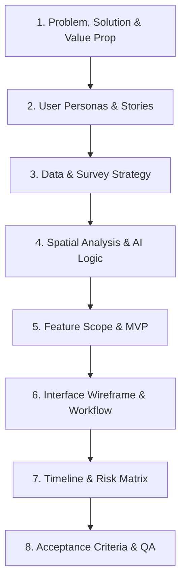

# Notulensi Coaching 1: Product Requirement Document (PRD)
**MAPID WebGIS Competition 2026**

---

| Parameter | Keterangan |
| :--- | :--- |
| **Topik** | Coaching 1: Penyusunan Product Requirement Document (PRD) |
| **Narasumber** | Mbak Muftia (Product & Coaching Lead MAPID) |
| **Moderator / MC** | Devina |
| **Sasaran** | Top 50 Tim Terkurasi MAPID WebGIS Competition 2026 |
| **Format Luaran PRD** | PDF (Dikumpulkan sebelum tahap pengembangan WebGIS) |

---

## 1. Konsep Dasar & Urgensi PRD

### 1.1 Mengapa PRD Diperlukan?
* **Jembatan Komunikasi (*Bridge*)**: PRD menjembatani kebutuhan bisnis (*business requirements*) yang diajukan pada proposal awal dengan eksekusi teknis oleh tim pengembang (*developers, UI/UX designer, QA*).
* **Penyelarasan Ekspektasi (*Expectation Alignment*)**: Mencegah terjadinya ketidaksesuaian antara apa yang diinginkan oleh pengguna (*user persona*) dengan fitur yang dibangun oleh tim *tech*.
* **Penetapan Batasan (*Scope Boundary*)**: PRD membatasi ruang lingkup pengembangan agar produk tidak berkembang tanpa batas (*scope creep*), fokus pada *Minimum Viable Product* (MVP) yang realistis diselesaikan dalam batas waktu kompetisi.

### 1.2 Pengguna PRD dalam Tim Development
1. **Developer (Front-end, Back-end, GIS, AI)**: Memahami logika sistem, struktur data, API endpoint, dan daftar fitur yang wajib dibangun (*executors*).
2. **UI/UX Designer**: Merancang alur pengguna (*user flow*) dan tata letak (*wireframe/dashboard anatomy*) yang relevan dengan permasalahan yang diselesaikan.
3. **Quality Assurance (QA)**: Menyusun skenario pengujian (*smoke testing*) untuk memastikan fungsionalitas utama aplikasi bebas dari *bug*.
4. **Business & Product Lead**: Memastikan produk yang dihasilkan tetap selaras dengan *problem statement* dan *value proposition* awal.

---

## 2. Pembagian Peran Anggota Tim dalam Menyusun PRD

PRD disusun secara kolaboratif sesuai keahlian bidang masing-masing anggota tim:

| Bidang / Keahlian | Tanggung Jawab Utama dalam PRD |
| :--- | :--- |
| **Geodesi / Geografi / Perencanaan Wilayah (PWK)** | • Meng-capture *problem statement* riil di lapangan. • Merumuskan *User Personas* dan *User Stories*. • Merancang strategi data primer (*Community Maps* & *Mission*) dan data sekunder. • Merumuskan metodologi analisis spasial (buffer, scoring AHP, spatial join, dll.). |
| **Teknologi Informasi (TI) / Ilmu Komputer / IS** | • Merancang Arsitektur Sistem (*System Architecture*). • Merinci integrasi AI (*Spatial Function Calling*, LLM, AI Logic). • Menentukan *Tech Stack* (Framework, Database PostGIS, API, Deployment). • Menyusun *Execution Timeline* dan skenario pengujian QA. |
| **Seluruh Anggota Tim (Kolaboratif)** | • Menentukan *Scope Boundary* (*In-Scope* vs *Out-of-Scope*). • Menyusun *Acceptance Criteria* dan kriteria keberhasilan produk. |

---

## 3. Modul & Struktur Utama Dokumen PRD

Dokumen PRD wajib mencakup 8 modul utama berikut:

### Modul 1: Problem Statement, Solution, & Value Proposition
* **Problem**: Identifikasi isu spesifik di lapangan yang akan diselesaikan (mengapa aplikasi ini perlu dibuat sekarang?).
* **Value Proposition**: Apa yang membuat platform WebGIS ini berbeda dan unggul dibandingkan solusi eksisting (misal: QGIS statis, portal pemerintah, atau platform commercial GIS)?

### Modul 2: User Personas & User Stories
* Menyusun minimal 2–3 persona berbeda sesuai target pengguna platform.
* **Format Penulisan User Story**:
  $$\text{Sebagai } [\text{Role User}], \text{ Saya ingin } [\text{Kebutuhan Fitur}] \text{ Agar } [\text{Manfaat/Goal}]$$
* *Contoh*: *"Sebagai Perencana Kota Pemkot, Saya ingin melihat TOD Readiness Score berbasis H3 Grid agar dapat menentukan prioritas anggaran pembangunan fasilitas pejalan kaki di simpul transit."*

### Modul 3: Data Community & Survey Strategy
* Merinci strategi data primer yang dikumpulkan via MAPID APPS (*Activity/Community Maps* dan *Mission*).
* Menentukan lokasi survei, target jumlah titik, serta keterkaitan data lapangan dengan model WebGIS.

### Modul 4: Spatial Analysis, AI Logic, & Backend Processing
* **Spatial Processing**: Alur pengolahan data spasial mentah dari lapangan (misal: *network buffer*, *spatial join*, *Uber H3 Hexagon Grid*, skoring AHP).
* **AI Integration**: Menjelaskan posisi AI di antarmuka WebGIS (misal: klasifikasi foto otomatis, ekstraksi deskripsi lapangan, atau *Spatial AI Assistant* berbasis LLM / Gemini API).
* **Backend Translation**: Bagaimana backend mengubah data GIS spasial menjadi format GeoJSON/MVT yang terstruktur dan cepat di-render di antarmuka web.

### Modul 5: Feature Scope & MVP (Minimum Viable Product)
* **In-Scope (Wajib)**: Fitur-fitur utama yang harus diselesaikan untuk menjawab tujuan produk.
* **Out-of-Scope (Ditunda/Diabaikan)**: Fitur yang tidak relevan dengan MVP saat ini (misal: *real-time train tracking*, sistem notifikasi SMS massal, atau cakupan seluruh Indonesia yang belum mendesak).

### Modul 6: Dashboard Anatomy, Wireframe, & Workflow
* **Wireframe Layout**: Tata letak peta interaktif, panel layer control, widget indikator chart, dan window interaksi AI.
* **System Workflow**: Alur komunikasi antara antarmuka pengguna (*Front-end*), pelayan API (*Back-end*), basis data (*PostGIS*), dan engine AI.

### Modul 7: Execution Timeline & Risk Matrix
* **Timeline Development**: Alur pengerjaan menggunakan metodologi *Agile/Scrum* dalam batas waktu kompetisi yang singkat.
* **Risk Matrix**: Identifikasi risiko pengembangan (teknis, latensi API, kuota berbayar, atau kendala data) beserta mitigasinya.

### Modul 8: Acceptance Criteria & QA Testing
* Menyusun skenario *smoke testing* sederhana untuk menguji fungsi krusial (misal: fungsi click popup peta, query AI function calling, filter data layer) mengembalikan status `200 OK`.

---

## 4. Rangkuman Sesi Q&A & Ketentuan Submission

### Q1: Apakah dokumen PRD dikumpulkan dalam bentuk PPT atau PDF? Dan kapan deadlinenya?
> **Jawaban**: Dikumpulkan dalam format **PDF**. PRD disusun dan disubmit **sebelum pengembangan fisik WebGIS dimulai**, sebagai panduan kerja tim.

### Q2: Bagaimana jika terjadi perubahan fitur dari proposal bisnis yang sudah pernah dikirimkan?
> **Jawaban**: 
> * Penyesuaian sangat diperbolehkan. Proposal bisnis di awal masih berupa ide bebas, sedangkan PRD adalah perencanaan realistis.
> * Jika ada fitur yang terpaksa dikurangi (*take out*), berikan justifikasi yang jelas di dalam PRD mengapa fitur tersebut ditunda (misal: keterbatasan kuota API atau efisiensi waktu).
> * Jika ada **penambahan/upgrade fitur** yang semakin memperkuat solusi awal, hal tersebut sangat diperbolehkan dan menjadi **nilai tambah (*plus point*)**.

### Q3: Apakah penilaian PRD menentukan kelolosan ke tahap selanjutnya?
> **Jawaban**: Ya. Tim penilai akan mengevaluasi konsistensi alur dari *Business Proposal* $\rightarrow$ *PRD Document* $\rightarrow$ *Final WebGIS Product*. PRD yang terstruktur dan konsisten memastikan produk akhir terbangun sesuai rencana.

### Q4: Sejauh mana perincian dampak/manfaat produk yang harus ditulis di PRD?
> **Jawaban**: Fokus pada *problem-solving* langsung (bagaimana fitur A menyelesaikan masalah B). Tidak perlu sampai memperhitungkan dampak ekonomi jangka panjang (*trickle-down effect*) secara berlebihan.

---

## 5. Checklist Kelengkapan Dokumen PRD

- [x] **Problem & Value Proposition**: Masalah spesifik, solusi yang ditawarkan, dan keunggulan kompetitif.
- [x] **User Personas & Stories**: Minimal 2–3 profil pengguna spesifik dengan format *As a... I want to... So that...*
- [x] **Data & Survey Strategy**: Perencanaan survei *Activity* (Community Maps) dan *Mission* MAPID APPS.
- [x] **Spatial & AI Logic**: Diagram alir pengolahan data spasial dan integrasi model AI pada interface.
- [x] **MVP Scope Boundaries**: Penegasan fitur *In-Scope* dan *Out-of-Scope*.
- [x] **Wireframe & System Workflow**: Blueprint visual antarmuka dan alur komunikasi frontend-backend.
- [x] **Execution Timeline & Risk Matrix**: Matriks jadwal pengerjaan dan langkah mitigasi risiko teknis.
- [x] **Acceptance Criteria**: Skenario uji QA smoke testing untuk fitur-fitur krusial.
