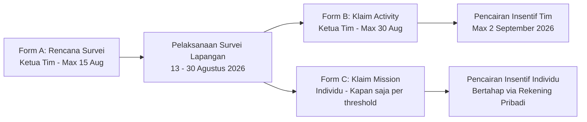

# Notulensi Technical Meeting 2 (TM2): Data, Survey System, & API Documentation
**MAPID WebGIS Competition 2026**

---

| Parameter | Keterangan |
| :--- | :--- |
| **Topik Sesi 1** | MAPID APPS & Survey System (Workflow & Pengumpulan Data Lapangan) |
| **Pemateri Sesi 1** | Mas Abil (GIS Specialist MAPID) |
| **Topik Sesi 2** | MAPID Documentation & API Maps (Integrasi API & Basemap) |
| **Pemateri Sesi 2** | Mas Egi (Developer Lead MAPID) |
| **Moderator / MC** | Esprali Putri (Esya) |
| **Sasaran** | Top 50 Tim Terkurasi MAPID WebGIS Competition 2026 |

---

## 1. Panduan Survei Lapangan MAPID APPS (Mas Abil)

### 1.1 Peran dan Pentingnya Data Survei Lapangan
* **Data Training AI**: Titik foto dan deskripsi naratif dari lapangan menjadi data latih (*training data*) untuk pemrosesan AI (ekstraksi teks, klasifikasi objek visual, dan peringkasan kondisi area).
* **Konten Utama WebGIS**: Menjadikan produk WebGIS memiliki data primer yang aktual dan mendalam di wilayah kajian, tidak hanya bergantung pada data sekunder publik.
* **Prinsip Kualitas vs Kuantitas**: Kualitas foto yang tajam dan kejelasan deskripsi lokasi lebih diutamakan dibandingkan sekadar kuantitas titik survei.

### 1.2 Klasifikasi Jenis Data Survei

| Aspek | Data Activity (Community Maps) — **WAJIB** | Data Mission — **OPSIONAL** |
| :--- | :--- | :--- |
| **Sifat Data** | Naratif, semiterstruktur (judul, deskripsi, foto/video, koordinat GPS). | Terstruktur padat sesuai template formulir (Properti Go, Struk Go, Menu Go). |
| **Penulisan Deskripsi** | Bahasa sehari-hari/populer (seperti entri media sosial), tanpa istilah jargon internal. | Mengikuti opsi dropdown & pilihan baku pada formulir aplikasi. |
| **Tagar Wajib** | **WAJIB mencantumkan `#NamaTim`** pada judul/deskripsi entri. | Tidak memerlukan tagar tim. |
| **Periode Survei** | **13 – 30 Agustus 2026** (Mengikat ketat). | Mengikuti jadwal challenge reguler MAPID APPS. |
| **Besaran Insentif** | **Rp3.000 / titik valid** (Maksimal 100 titik = Rp300.000 per tim). | Sesuai *threshold* misi (Rp50.000 per ambang batas). |
| **Mekanisme Klaim** | 1 kali di akhir oleh Ketua Tim (*Form B*). | Bertahap saat ambang batas tercapai oleh masing-masing surveyor (*Form C*). |

#### Rincian Ambang Batas Data Mission (Opsional):
1. **Properti Go**: Pendokumentasian properti dijual/disewakan (Rumah, Ruko, Kos, Tanah). **100 titik valid = Rp50.000**.
2. **Struk Go**: Transaksi riil (Resto, Minimarket, Apotek, Transportasi) max 3 hari terakhir. **30 titik valid = Rp50.000**.
3. **Menu Go**: Profil tempat makan/kaki lima, foto menu, dan estimasi harga. **100 titik valid = Rp50.000**.

### 1.3 Alur Formulir Administrasi Survei



* **Form A (Rencana Survei)**: Wajib diisi Ketua Tim sebelum survei dimulai (paling lambat **15 Agustus 2026**). Berisi area studi, target titik, tagar tim, serta daftar username MAPID anggota tim & surveyor pendukung.
* **Form B (Klaim Activity)**: Diisi Ketua Tim di akhir periode (paling lambat **30 Agustus 2026, 23:59 WIB**) untuk mencantumkan rekapitulasi titik *Activity* dan 1 nomor rekening ketua tim.
* **Form C (Klaim Mission)**: Diisi oleh masing-masing surveyor setiap kali mencapai ambang batas (*threshold*) misi.

### 1.4 Pembagian Koordinator Pendamping Tim
Panitia membagi 50 tim terkurasi ke dalam 3 Koordinator Pendamping untuk asistensi teknis dan validasi data survei:
* **Tim 01 – 17**: Koordinator **Regi**
* **Tim 18 – 34**: Koordinator **Fati**
* **Tim 35 – 50**: Koordinator **Reza**

---

## 2. Dokumentasi MAPID MAPS & API Data Access (Mas Egi)

### 2.1 Penggunaan Basemap Wajib
* Produk WebGIS peserta **WAJIB** menggunakan **MAPID MAPS** sebagai basemap utama.
* Dikembangkan berbasis library **MapLibre GL JS** / **Mapbox Style Specification**.
* **URL Style Basemap**:
  * Street: `https://p2basemap.mapid.io/styles/street/style.json?key={YOUR_MAPID_API_KEY}`
  * Dark: `https://p2basemap.mapid.io/styles/dark/style.json?key={YOUR_MAPID_API_KEY}`
  * Satellite: `https://p2basemap.mapid.io/styles/satellite/style.json?key={YOUR_MAPID_API_KEY}`

### 2.2 Integrasi REST API Data Competition
Untuk mengintegrasikan data survei *Activity* dan *Mission* ke dalam backend/frontend WebGIS peserta:

* **Base Endpoint**: `https://server.mapid.io/web/competition/`
* **Method**: `POST` (Body mengandung parameter GeoJSON Polygon filter lokasi).
* **Header Autentikasi**:
  * `Content-Type`: `application/json`
  * `X-API-KEY`: `{YOUR_MAPID_API_KEY}` *(Dihasilkan dari Dashboard GEO MAPID)*

#### Skenario Post Body Request (GeoJSON Polygon Filter):
```json
{
  "type": "Feature",
  "geometry": {
    "type": "Polygon",
    "coordinates": [
      [
        [112.73, -7.25],
        [112.76, -7.25],
        [112.76, -7.28],
        [112.73, -7.28],
        [112.73, -7.25]
      ]
    ]
  },
  "offset": 0,
  "hashtag": ["PakSibukGa"]
}
```

#### Pengaturan Pagination (Offset & Limits):
* **Mission Data**: Dikembalikan dalam bentuk GeoJSON FeatureCollection (Maksimal 100 titik per request). Menggunakan parameter `offset` jika total data (`total`) > 100 dan `hasMore` bernilai `true`.
* **Activity Data**: Dikembalikan maksimal 60 titik per request.

---

## 3. Rangkuman Sesi Q&A & Ketentuan Tambahan TM2

### Q1: Apakah tim diperbolehkan menggunakan data sekunder dari luar MAPID?
> **Jawaban**: Sangat diperbolehkan. Selama data sekunder terbuka/resmi (misal: BPS, OpenStreetMap, ATR/BPN, InaRISK) dan sumber datanya dicantumkan secara transparan dalam dokumen metodologi WebGIS.

### Q2: Apakah lisensi API Key MAPID boleh digunakan oleh seluruh anggota tim teknis?
> **Jawaban**: Ya. Lisensi di-redeem oleh perwakilan tim di Dashboard GEO MAPID. Kode API Key dapat dibagikan di internal tim teknis/developer untuk di-embed pada file environment (`.env`).

### Q3: Berapa batas waktu perbaikan jika data survei dinyatakan butuh revisi oleh koordinator?
> **Jawaban**: Koordinator akan menginformasikan titik yang perlu diperbaiki secara berkala selama periode survei (13–30 Agustus 2026). Tim disarankan melakukan survei lebih awal agar memiliki waktu untuk merevisi jika ada titik yang ditolak.

### Q4: Kapan jam survei yang dilarang di aplikasi MAPID APPS?
> **Jawaban**: Hindari pengunggahan data pada rentang jam **16:00 – 17:00 WIB** karena sistem server MAPID melakukan pemeliharaan dan sinkronisasi rutin harian.
