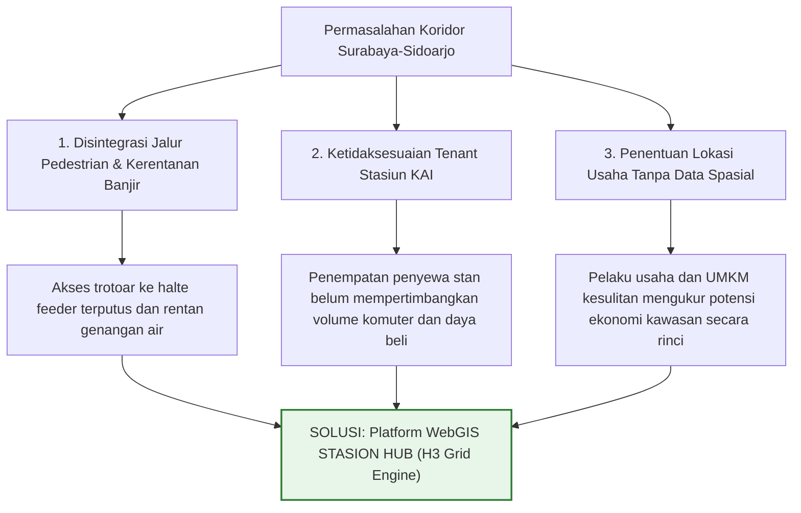
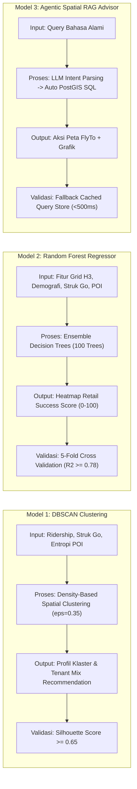
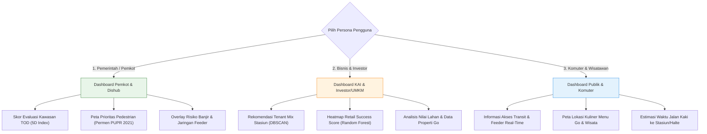
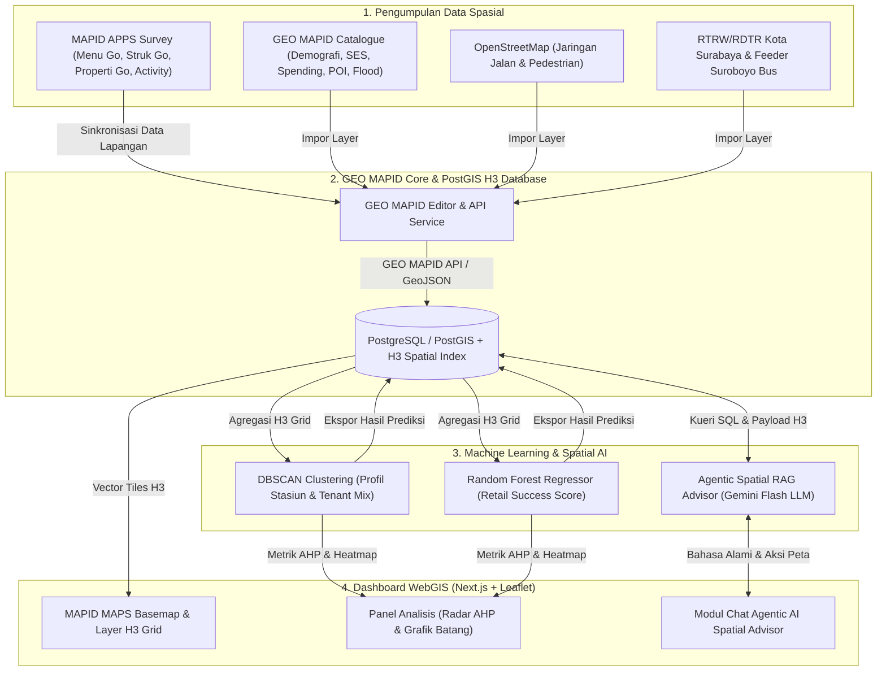

# PROPOSAL IDE PROYEK - MAPID WEBGIS COMPETITION 2026

# STASION HUB: Spatial Hexagonal Grid Decision Engine & Agentic AI Advisor untuk Pengembangan Kawasan TOD Perkotaan Surabaya-Sidoarjo

---

**TEMA KOMPETISI:** *Maps That Think!: Mass Transportation Edition*  
**JUDUL PROYEK:** *STASION HUB: Hexagonal Grid TOD Indexing & Agentic AI Spatial Advisor (STASION HUB)*  
**NAMA TIM:** pak, sibuk ga?  
**INSTANSI / UNIVERSITAS:** [Nama Perguruan Tinggi Peserta]  
**KONTAK UTAMA:** [Email Ketua Tim] | [Nomor WhatsApp]  

---

## RINGKASAN EKSEKUTIF (EXECUTIVE SUMMARY)

Kawasan Metropolitan Surabaya dan Sidoarjo menghadapi masalah integrasi antara moda transportasi massal, seperti Kereta Api (KA) Commuter Surabaya-Sidoarjo (SUSI) dan pengumpan (*feeder*) Suroboyo Bus/Trans Jatim, dengan kegiatan ekonomi lokal di sekitar stasiun. Meskipun koridor ini memiliki 8 stasiun utama dan puluhan halte transit, pemanfaatannya belum optimal. Akses pejalan kaki (*first-mile/last-mile*) terhalang kendala fisik dan genangan banjir, jenis penyewa stan stasiun sering tidak sesuai dengan profil komuter (*tenant mismatch*), serta UMKM dan investor kesulitan mengidentifikasi potensi lokasi usaha karena minimnya data spasial granular yang terintegrasi.

Untuk mengatasi masalah tersebut, **STASION HUB** dibangun sebagai platform *Decision Support System* (DSS) berbasis WebGIS interaktif sesuai konsep *"Maps That Think!"*. Platform ini mengarahkan seluruh data spasial, meliputi kepadatan populasi, daya beli riil (Struk Go), variasi usaha (Menu Go), listing properti (Properti Go), kerentanan banjir, dan sentimen publik, ke dalam sistem sel heksagonal **H3 Hexagonal Grid Framework** di sepanjang koridor transit.

STASION HUB dilengkapi dengan fitur **Agentic AI Spatial Advisor (Gemini Flash + PostGIS)** yang dirancang untuk tiga kelompok pengguna: **Pemerintah (Pemkot/Dishub)** untuk evaluasi kawasan TOD dan perencanaan trotoar, **Bisnis & Investor (PT KAI & UMKM)** untuk pemetaan potensi ritel (*Retail Success Score*) dan alokasi *Tenant Mix*, serta **Komuter** untuk informasi aksesibilitas transit. Seluruh sistem mengintegrasikan data dari **GEO MAPID**, **MAPID MAPS**, dan data survei lapangan melalui **MAPID Apps**.

---

## 1. SOLUSI YANG DIUSULKAN

### 1.1 Deskripsi Solusi dan Masalah yang Diselesaikan

Mobilitas harian di koridor Surabaya-Sidoarjo mengandalkan Kereta Api Commuter SUSI dan jaringan *feeder* bus kota. Berdasarkan Peraturan Daerah Kota Surabaya Nomor 8 Tahun 2024 tentang RTRW, area stasiun ditargetkan sebagai simpul *Transit-Oriented Development* (TOD). Namun, pengembangan kawasan menghadapi tiga masalah utama:

1. **Disintegrasi Jalur Pedestrian & Kerentanan Banjir:** Akses pejalan kaki dari stasiun KAI ke halte *feeder* terputus oleh hambatan fisik dan genangan air saat hujan.
2. **Ketidaksesuaian Penyewa Stasiun (*Tenant Mismatch*):** Alokasi stan komersial di stasiun KAI DAOP 8 belum memperhitungkan profil pengeluaran dan jumlah komuter harian, sehingga memicu risiko stan kosong.
3. **Penentuan Lokasi Usaha Tanpa Data Spasial:** UMKM dan pengembang tidak memiliki alat analitik untuk mengukur potensi komersial kawasan secara akurat.

**STASION HUB** dirancang sebagai **WebGIS Decision Support System** yang mengolah data multi-sektor ke dalam format *Hexagonal Spatial Grid* untuk menghasilkan analisis kawasan yang obyektif dan terukur.

---

### 1.2 Kerangka Spasial Grid Heksagonal & Visualisasi Data

#### A. Sistem Grid Heksagonal (H3 Spatial Grid Framework)
Guna menyelaraskan berbagai sumber data, wilayah studi di sepanjang 8 stasiun pilot (*Surabaya Gubeng, Pasar Turi, Surabaya Kota, Wonokromo, Waru, Gedangan, Sidoarjo, Tanggulangin*) dan halte *feeder* dibagi ke dalam sel **Grid Heksagonal H3 (Resolusi 9, luas ~0.1 km²)**. Setiap sel berfungsi sebagai unit analisis spasial yang menyimpan data:
- **Transportasi:** Jarak tempuh ke stasiun/halte terdekat dan frekuensi moda *feeder*.
- **Ekonomi Mikro:** Jumlah merchant Menu Go, volume transaksi Struk Go, serta listing Properti Go.
- **Demografi & Pengeluaran:** *People Density* dan *People Spending* dari MAPID Catalogue.
- **Lingkungan & Risiko:** Peta kerentanan banjir MAPID dan tingkat pencahayaan malam (*Nighttime Light*).

#### B. Visualisasi & Interaktivitas WebGIS
- **Basemap Utama:** **MAPID MAPS Basemap** (Vector tile dengan tampilan dark mode).
- **Interaksi Sel Grid & Panel Analisis:** Pemilihan sel heksagonal pada peta akan membuka panel informasi yang menampilkan:
  - Diagram Radar AHP (*Analytical Hierarchy Process*) breakdown variabel kawasan.
  - Grafik batang distribusi pengeluaran konsumen (Struk Go) dan variasi menu (Menu Go).
  - Skor estimasi nilai lahan komersial serta tingkat kelayakan lokasi usaha (*Retail Success Score*).
  - Foto kondisi lapangan dari survei MAPID Apps beserta ringkasan sentimen publik.

---

### 1.3 Metode Analisis Spasial dan Skoring AHP

1. **Indeks 5D TOD Berbasis Grid (Lyu et al., 2021; Thomas & Bertolini, 2021):**
   Evaluasi kawasan TOD dihitung pada tiap sel heksagonal dengan menggunakan 5 dimensi:
   - **Density ($D_1$):** Kepadatan penduduk per sel grid (Data Demografi MAPID).
   - **Diversity ($D_2$):** Indeks Entropi Shannon untuk variasi lokasi komersial (Menu Go & MAPID Catalog):
     $$H = -\sum_{k=1}^{n} p_k \ln(p_k)$$
   - **Design ($D_3$):** Indeks kenyamanan fasilitas pejalan kaki (*Walkability Index*).
   - **Distance ($D_4$):** Jarak rata-rata jaringan jalan menuju titik transit terdekat.
   - **Destination Accessibility ($D_5$):** Kemudahan akses menuju halte pengumpan (*feeder*) (Zhang et al., 2023).

2. **Penilaian Fasilitas Pedestrian & Walkability Index:**
   Kualitas jalur pejalan kaki dievaluasi berdasarkan rujukan teknis:
   - **Pedoman Teknis Fasilitas Pejalan Kaki Permen PUPR (2021):** Standar penyediaan trotoar, jalur pemandu, dan peneduh.
   - **Frank et al. (2021) dan Campisi et al. (2021):** Metode evaluasi aksesibilitas pejalan kaki di area simpul transit.
   - **Wang & Zhou (2023):** Penilaian aksesibilitas pejalan kaki menggunakan data spasial terbuka.
   
   Data kondisi fisik dilaporkan secara langsung dari survei lapangan (*Survey Activities*) memakai aplikasi MAPID Apps.

---

### 1.4 Pemodelan AI & Alur Kerja Sistem (Input, Proses, Output, Validasi)

Platform STASION HUB menerapkan tiga pemodelan Kecerdasan Buatan (AI) untuk pemrosesan data spasial:

#### Rincian Pemodelan AI:

1. **Model 1: DBSCAN Clustering & Rekomendasi Tenant Mix (Hao et al., 2023)**
   - **Input:** Jumlah komuter stasiun, rata-rata nilai transaksi Struk Go, dan Indeks Entropi POI Menu Go.
   - **Proses:** Pengelompokan spasial berbasis kepadatan ($\epsilon = 0.35, \text{minSamples} = 2$) untuk mengategorikan stasiun ke dalam 3 profil (Transit Hub Utama, Feeder Padat, dan Area Suburban/UMKM).
   - **Output:** Matriks Rekomendasi *Tenant Mix* (proporsi ritel F&B, minimarket, jasa, dan UMKM per stasiun).
   - **Validasi:** Evaluasi pemisahan klaster menggunakan *Silhouette Coefficient* (target $\ge 0.65$).

2. **Model 2: Random Forest Regressor & Retail Success Score (RSS) (He et al., 2025; Zhou et al., 2022)**
   - **Input:** Fitur spasial per sel H3 (jarak stasiun, kepadatan populasi, transaksi Struk Go, indeks kompetitor Menu Go, skor pedestrian, dan zonasi RDTR).
   - **Proses:** Regresi *Random Forest* (100 decision trees) untuk menghitung skor kelayakan usaha $RSS(p,c)$ pada skala 0-100:
     $$RSS(p, c) = 100 \times \left( 0.4 FT(p) + 0.3 SP(p) - 0.2 CD(p, c) + 0.1 WS(p) \right)$$
   - **Output:** Peta sebaran skor kelayakan usaha (*heatmap*) untuk 4 kategori bisnis (F&B Tradisional, F&B Modern, Minimarket, dan Souvenir).
   - **Validasi:** Pengujian model melalui *5-Fold Cross-Validation* ($R^2 \ge 0.78$, MAE $< 6.5$).

3. **Model 3: Agentic Spatial RAG Advisor & Strategi Latensi Demo (Li et al., 2024; Zhang et al., 2024)**
   - **Input:** Pertanyaan bahasa alami pengguna pada kolom chat (contoh: *"Sel grid mana di sekitar Stasiun Waru yang sesuai untuk usaha kuliner dan bebas banjir?"*).
   - **Proses:** Gemini Flash memproses maksud pengguna, membuat kueri SQL PostGIS secara otomatis (`ST_DWithin`, `ST_Intersects`), mengeksekusinya pada basis data, dan menyusun analisis sentimen.
   - **Penanganan Latensi:** Untuk menghindari penundaan respons API LLM saat demonstrasi, sistem dilengkapi *In-Memory Query Cache Store*. Jika durasi panggil API melebihi 1.5 detik, sistem otomatis mengambil hasil kueri ter-cache dengan waktu respon di bawah 500 ms agar navigasi peta (*flyTo*) tetap lancar.
   - **Output:** Teks rekomendasi dan payload data spasial JSON untuk menggerakkan peta Next.js (`map.flyTo()`, sorotan sel heksagonal, dan pembaruan grafik radar AHP).
   - **Validasi:** Sanitasi kueri SQL untuk keamanan data, pengecekan sintaksis, dan penanganan kondisi saat data tidak ditemukan.

---

### 1.5 Segmentasi Persona Pengguna

Antarmuka WebGIS dibedakan untuk tiga kelompok pengguna sesuai kebutuhan analisis:

---

### 1.6 Arsitektur Integrasi Sistem

---

## 2. POTENSI WEBGIS DAN MANFAAT

### 2.1 Target Pengguna dan Skalabilitas Sistem

Platform STASION HUB ditujukan bagi empat kelompok pengguna:

1. **PT KAI (Persero) DAOP 8 Surabaya:** Membantu pengelola stasiun dalam penataan area komersial dan penyesuaian *tenant mix* dengan arus komuter.
2. **Pemerintah Kota Surabaya, Sidoarjo, Bappeda, & Dishub:** Sebagai bahan evaluasi kawasan TOD serta penentuan prioritas perbaikan jalur trotoar.
3. **Pelaku Usaha Ritel & UMKM:** Membantu pemilihan lokasi usaha berbasis data transaksi riil konsumen.
4. **Skalabilitas Sistem:** Struktur data *H3 Spatial Grid* dan alur pemodelan AI dirancang fleksibel sehingga dapat **diterapkan di koridor kereta api perkotaan lain** di Indonesia (seperti KRL Yogyakarta-Solo, KA Commuter Line Bandung Raya, LRT Jabodebek, maupun rencana LRT Surabaya).

---

### 2.2 Perbandingan Fitur dan Keunggulan Platform

| Fitur / Parameter | WebGIS TOD Konvensional | Platform Properti Umum | STASION HUB (Solusi Kami) |
| :--- | :---: | :---: | :---: |
| **Cakupan Wilayah** | Terpusat Jabodetabek | Skala Kota/Kabupaten | **Koridor Surabaya-Sidoarjo (Jawa Timur)** |
| **Kerangka Spasial** | Batas Administrasi | Titik Peta Statis | **H3 Hexagonal Spatial Grid System** |
| **Sumber Data Utama** | Data Sekunder BPS | Listing Properti Pasif | **MAPID Data Catalog + Survei MAPID Apps** |
| **Data Transaksi Riil** | Tidak Ada | Tidak Ada | **Integrasi Data Struk Go & Menu Go** |
| **Segmentasi Pengguna** | Satu Persona | Pengguna Umum | **Tiga Persona (Pemerintah, Bisnis/UMKM, Komuter)** |
| **Integrasi AI Spasial** | Tidak Ada / Bot Biasa | Chatbot Non-Spasial | **Agentic AI Spatial Advisor (Gemini + PostGIS)** |

---

### 2.3 Dampak Terukur

- **Bagi PT KAI DAOP 8:** Penataan alokasi penyewa stan yang sesuai dengan profil penumpang harian untuk meminimalkan stan kosong.
- **Bagi Pemkot Surabaya:** Efisiensi perencanaan trotoar oleh Dinas PUPR dengan fokus pada segmen jalur pedestrian yang membutuhkan perbaikan berdasarkan evaluasi Permen PUPR.
- **Bagi UMKM & Investor:** Kemudahan penentuan lokasi usaha baru melalui pemetaan tingkat kelayakan kawasan (*Retail Success Score*) berbasis data transaksi Struk Go.

---

## 3. KELAYAKAN TEKNIS

### 3.1 Arsitektur Perangkat Lunak dan Tech Stack

Pengembangan sistem menggunakan komponen *open-source* untuk efisiensi dan fleksibilitas integrasi:

- **Frontend:** Next.js (React Framework), Leaflet.js, MAPID MAPS API Basemap, Lucide Icons, Chart.js (Diagram Radar AHP & Grafik Batang).
- **Backend & Basis Data:** FastAPI (Python), PostgreSQL 16 dengan ekstensi PostGIS 3.4 & H3-PostGIS.
- **Pemodelan Data & AI:** GeoPandas, Scikit-Learn (Random Forest Regressor, DBSCAN Clustering), H3-Py (Uber H3 Grid System), Google Gemini Flash API.
- **Infrastruktur Cloud:** Vercel (Hosting Frontend), Render/Railway (Backend Python API), GEO MAPID (Penyimpanan Layer Spasial).

---

### 3.2 Alur Pengelolaan Data via GEO MAPID

1. **Pengumpulan Data:** Data hasil survei lapangan dari MAPID Apps (*Menu Go, Struk Go, Properti Go, Activity*) dan dataset MAPID Data Catalog diunggah ke **GEO MAPID Editor**.
2. **Pengolahan Spasial:** Pembersihan data, agregasi ke sel grid H3, dan penyesuaian sistem proyeksi CRS EPSG:4326 (WGS 84) di dalam GEO MAPID.
3. **Publikasi API:** Data dipublikasikan sebagai vector layer/GeoJSON API yang dihubungkan ke aplikasi Next.js dan basis data PostGIS.
4. **Deploy Aplikasi:** WebGIS diunggah secara publik menggunakan platform **Vercel**.

---

### 3.3 Rencana Survei Lapangan, Protokol Data, & Anggaran

Survei lapangan dilakukan secara terstruktur menggunakan **MAPID APPS** selama periode Agustus hingga September 2026:

- **Lokasi Target:** 8 Stasiun Pilot Koridor Surabaya-Sidoarjo (*Surabaya Gubeng, Surabaya Pasar Turi, Surabaya Kota, Wonokromo, Waru, Gedangan, Sidoarjo, Tanggulangin*).
- **Jangkauan Sampel:** Radius 500 meter dari pintu keluar stasiun dengan titik pengamatan tiap interval 50 meter di sepanjang jalan utama.
- **Waktu Pengamatan (3 Sesi):** *AM Peak* (06.30 - 08.30 WIB), *Off-Peak* (11.00 - 13.00 WIB), dan *PM Peak* (16.30 - 18.30 WIB).
- **Penggunaan Anggaran Survei:** Dana *Survey Activity Budget* dari panitia MAPID dialokasikan untuk operasional transportasi lokal, konsumsi surveyor, dan pengujian transaksi riil *Struk Go* di area stasiun serta koridor *feeder*.
- **Target Data Survei:** 200+ titik Menu Go, 100+ transaksi Struk Go, 50+ listing Properti Go, dan 30+ dokumentasi Walkability Activity.

---

## 4. KESIMPULAN

Proposal **STASION HUB** menyajikan pendekatan analitis untuk mendukung integrasi transportasi massal dan aktivitas ekonomi lokal di Koridor Surabaya-Sidoarjo. Melalui penerapan **Hexagonal Spatial Grid System (H3 Grid)**, pemodelan machine learning (**DBSCAN dan Random Forest**), serta integrasi **Agentic AI Spatial Advisor**, platform ini mengimplementasikan konsep *"Maps That Think!"* secara praktis.

Dengan memanfaatkan ekosistem **GEO MAPID, MAPID MAPS, dan MAPID Apps**, STASION HUB menyediakan *Decision Support System* yang dapat dimanfaatkan oleh PT KAI DAOP 8, Pemerintah Kota Surabaya, maupun pelaku UMKM. Sistem ini dirancang menggunakan teknologi open-source sehingga memiliki kelayakan teknis yang baik dan siap diimplementasikan pada ajang MAPID Catalyst 2026.

---

## 5. LAMPIRAN 1: ASSESSMENT TIM

### Data Anggota Tim:
1. **[Nama Ketua Tim]** - *Project Leader & Business Analyst* ([Nama Universitas])
2. **[Nama Anggota 2]** - *WebGIS Frontend & UI/UX Developer* ([Nama Universitas])
3. **[Nama Anggota 3]** - *Data Scientist & Spatial AI Engineer* ([Nama Universitas])
4. **[Nama Anggota 4 - Opsional]** - *GIS Analyst & Field Survey Coordinator* ([Nama Universitas])
5. **[Nama Anggota 5 - Opsional]** - *Backend & Spatial Database Engineer* ([Nama Universitas])

---

### Jawaban Pertanyaan Assessment Teknis Tim:

#### 1. Framework atau library apa yang Anda kuasai untuk pengembangan frontend?
> **Jawaban Tim:**  
> Tim kami menguasai **Next.js (React Framework)** dan **JavaScript/TypeScript** untuk membangun antarmuka web. Untuk peta interaktif, kami menggunakan **Leaflet.js** dan **Mapbox GL JS / Maplibre JS** yang terhubung dengan **MAPID MAPS API** sebagai basemap. Pustaka pendukung seperti **Chart.js** dan **Tailwind CSS** digunakan untuk menyajikan data grafik dan tata letak dashboard.

#### 2. Apa bahasa pemrograman dan framework backend yang pernah Anda gunakan?
> **Jawaban Tim:**  
> Untuk backend dan integrasi AI, kami menggunakan **Python** dengan framework **FastAPI** dan **Flask**. FastAPI dipilih karena mendukung pemrosesan asynchronous untuk menangani kueri spasial dan panggilan API **Google Gemini Flash LLM**. Kami juga berpengalaman membuat RESTful API menggunakan **Node.js (Express.js)**.

#### 3. Apa jenis database yang pernah Anda gunakan untuk menyimpan data geospasial?
> **Jawaban Tim:**  
> Pengolahan data geospasial dilakukan menggunakan basis data **PostgreSQL** dengan ekstensi **PostGIS** dan indeks heksagonal **H3-PostGIS**. Kami terbiasa mengoperasikan kueri spasial seperti `ST_DWithin`, `ST_Distance`, `ST_Buffer`, `ST_Contains`, dan `ST_Intersects`. Selain itu, **GEO MAPID Cloud Database** dimanfaatkan untuk manajemen dan publikasi layer data.

---

### DAFTAR PUSTAKA (LITERATUR TERBARU 2021-2026)

1. **Campisi, T., dkk. (2021).** *Assessment of Walkability and Pedestrian Accessibility in Public Transit Hubs*. Sustainability, 13(17), 9876.
2. **Frank, L. D., dkk. (2021).** *Evaluating Walkability and Health Impacts near Urban Mass Transit Corridors*. Journal of Transport & Health, 22, 101120.
3. **Hao, Y., dkk. (2023).** *DBSCAN clustering application in passenger distribution and urban mobility pattern detection*. Applied Sciences, 13(4), 2110.
4. **He, X., dkk. (2025).** *Application of Random Forest in retail site selection based on urban functional zones*. Land, 14(1), 112.
5. **Kementerian Pekerjaan Umum dan Perumahan Rakyat. (2021).** *Pedoman Teknis Perencanaan Fasilitas Pejalan Kaki di Kawasan Perkotaan (Revisi)*. Jakarta: Direktorat Jenderal Cipta Karya.
6. **Li, W., dkk. (2024).** *Spatial RAG: Integrating Large Language Models with Spatial Databases for Natural Language GIS Queries*. ISPRS International Journal of Geo-Information, 13(2), 45.
7. **Lyu, G., dkk. (2021).** *Developing a Node-Place-Design model for Transit-Oriented Development (TOD) indexing*. Journal of Transport Geography, 96, 103180.
8. **MAPID. (2026).** *Ketentuan Data & WebGIS - MAPID WebGIS Competition 2026*. Bandung: PT Multi Areal Planing Indonesia.
9. **Pemerintah Kota Surabaya. (2024).** *Peraturan Daerah Kota Surabaya Nomor 8 Tahun 2024 tentang Rencana Tata Ruang Wilayah (RTRW) Kota Surabaya Tahun 2024-2044*. Surabaya: Pemerintah Kota.
10. **Thomas, R., & Bertolini, L. (2021).** *Defining Transit-Oriented Development (TOD) Indexing for Sustainable Cities*. Transport Reviews, 41(1), 25-47.
11. **Wang, J., & Zhou, Y. (2023).** *Assessing urban walkability around transit stations using multi-source open spatial data*. Computers, Environment and Urban Systems, 102, 101962.
12. **Zhang, H., dkk. (2024).** *Conversational WebGIS: Leveraging LLMs for natural language spatial retrieval and map generation*. Computers, Environment and Urban Systems, 108, 102075.
13. **Zhang, Y., dkk. (2023).** *Evaluating multi-modal accessibility and TOD node performance in metropolitan transit corridors*. Transportation Research Part D, 115, 103590.
14. **Zhou, Y., dkk. (2022).** *Convenience store location prediction model based on hybrid MTS-Random Forest machine learning*. PLOS ONE, 17(8), e0271345.