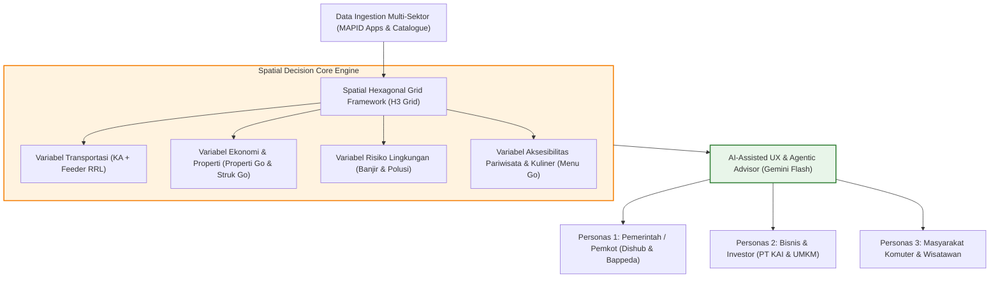
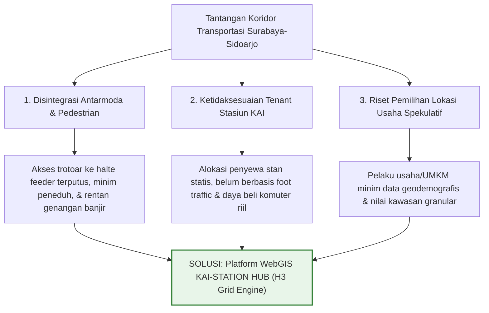
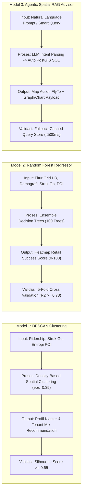
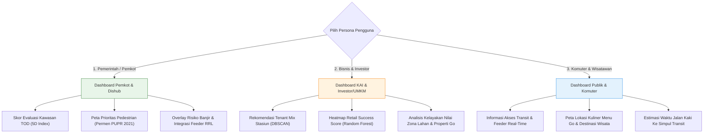
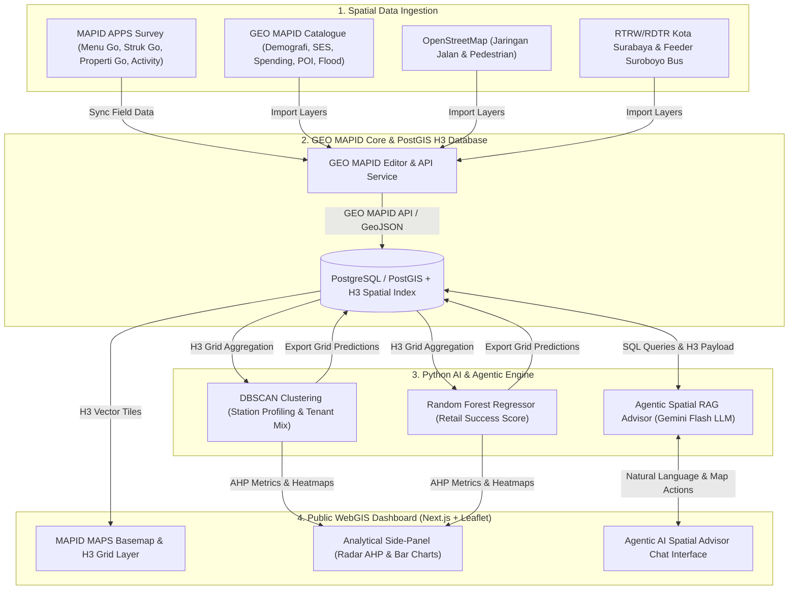

# LAPORAN EVALUASI STRATEGIS & PROPOSAL FINAL WEBGIS
## MAPID WebGIS Competition 2026 — Mass Transportation Edition ("Maps That Think!")

---

## BAGIAN A: ANALISIS KRITIS & JAWABAN REKOMENDASI (DOSEN PEMBIMBING & JURI)

### 1. Tanggapan Kritis: Apakah Fitur Aplikasi Terlalu Luas atau Generik?
**Jawaban Singkat:** Fitur aplikasi **TIDAK TERLALU LUAS** jika diikat oleh satu **Sistem Kerangka Spasial Tunggal (Unified Spatial Framework)**. 

Catatan masukan dari **Pak Ryo (Dosen Pembimbing)** sangat tajam dan solutif:
> *"Kalo dari tahun lalu bukan analisis rute, tapi ke membaca data dan webgisnya menyajikan data supaya yang mengambil keputusan orang yang menggunakan web... Malah bisa idenya Rayhan/Rayka, cuman diwujudkan dalam bentuk grid hexagon... Nanti diklik salah satu grid ga cuma keluar index, tapi ada grafik juga."*

**Strategi Refactoring Ruang Lingkup:**
Alih-alih membuat banyak modul terpisah yang terfragmentasi, seluruh variabel (nilai lahan/properti, kepadatan, risiko banjir, POI ekonomi Menu/Struk Go, dan aksesibilitas *feeder*) disatukan ke dalam **Sistem Grid Heksagonal Spasial (H3 Hexagonal Grid System)** di sepanjang koridor stasiun dan halte transportasi massal. 

Dengan pendekatan **Hexagonal Grid Decision Engine**, WebGIS tidak terjebak menjadi aplikasi *route planner* (yang merupakan fungsi analisis internal saja), melainkan bertindak murni sebagai **Decision Support System (DSS)** berbasis visualisasi interaktif yang menyajikan data secara *end-to-end* agar pengguna dapat mengambil keputusan secara mandiri.

---

### 2. Sintesis Rekomendasi Utama Notulensi Pembimbing & KAI Partnership

1. **Fokus Interseksi Transportasi Massal (KAI + Feeder RRL):**
   - Fokus bukan sekadar jalur rel KAI, tetapi **konektivitas antar-simpul (*Regional Railway Line / RRL*)** yang dihubungkan dengan moda pengumpan (*feeder* Suroboyo Bus & Trans Jatim) serta jaringan pejalan kaki.
   - Mengombinasikan data transportasi eksisting dengan kawasan padat penduduk, nilai zona lahan komersial, dan **overlay risiko lingkungan (Wilayah Risiko Banjir MAPID)**.
2. **Pemanfaatan AI-Assisted User Experience (Agentic AI Advisor):**
   - AI di dalam WebGIS bertindak sebagai **Agentic AI Advisor & Interactive Analytics Engine** (bukan sekadar chatbot teks biasa).
   - Pengguna dapat melakukan *natural language smart query* (contoh: *"Jika saya membuka usaha kuliner di grid ini dekat Stasiun Waru, bagaimana nilai kawasan dan risiko banjirnya?"*).
   - AI merespons secara agentic dengan memicu aksi peta (*flyTo, highlight grid, popup grafik radar AHP, dan analisis sentimen publik*).
3. **Segmentasi 3 Persona Pengguna (Tiga Hak Akses Utuh):**
   - **Pemerintah (Pemkot/Dishub/Bappeda):** Evaluasi skor TOD kawasan, prioritas jalur pedestrian, integrasi halte feeder RRL, dan mitigasi banjir.
   - **Bisnis & Investor (PT KAI & UMKM):** Analisis kelayakan lokasi usaha (*Retail Success Score*), estimasi nilai kawasan, dan rekomendasi *Tenant Mix* stasiun.
   - **Masyarakat Komuter & Wisatawan:** Informasi aksesibilitas simpul transit terdekat, rute jalan kaki ke titik wisata/kuliner (Menu Go), serta estimasi waktu tempuh.
4. **Metodologi Skoring AHP Terstandarisasi:**
   - Pembobotan variabel pada *Hexagonal Grid* disandarkan pada metodologi **Analytic Hierarchy Process (AHP)** berbasis literatur PWK/Perencanaan Perkotaan mutakhir (2021–2026).

---

## BAGIAN B: TABEL PEMETAAN DATA MAPID & LOGIKA AI REVISI

### 1. Tabel Pemetaan Data MAPID (Terintegrasi H3 Grid Framework)

| Nama Dataset / Layer | Kategori Data | Geometry | Tahun | Peran & Kegunaan Spesifik dalam H3 Grid Analytics |
| :--- | :--- | :--- | :--- | :--- |
| **Menu Go** | Mission (Primary) | Point | 2026 | Memetakan profil merchant kuliner, variasi harga menu, keramaian pembeli, & mobilitas tempat makan. Agregasi ke grid H3 sebagai *Commercial Diversity Index*. |
| **Struk Go** | Mission (Primary) | Point | 2026 | Memetakan transaksi riil & metode bayar (QRIS/Cash) sebagai proksi daya beli riil masyarakat per grid. |
| **Properti Go** | Mission (Primary) | Point | 2026 | Memetakan listing ruko/lahan komersial disewakan/dijual untuk analisis kelayakan nilai kawasan ritel (*Land Value Zone*). |
| **Community Maps (Activity)** | Activity (Primary) | Point | 2026 | Dokumentasi lapangan kondisi trotoar, isu sirkulasi pejalan kaki, dan analisis sentimen publik kawasan transit. |
| **Jaringan Rel Kereta Indonesia** | Catalog (Secondary) | LineString | 2023 | Jalur utama KA Commuter SUSI & koridor utama pergerakan rel KAI DAOP 8. |
| **Stasiun, Halte, & Terminal** | Catalog (Secondary) | Point | 2024 | Simpul acuan TOD utama dan pusat perhitungan buffer & peluruhan jarak jaringan pejalan kaki (*network decay*). |
| **People Spending & Demografi** | Catalog (Secondary) | Polygon | 2024 | Agregasi kepadatan populasi (*Density*) dan daya beli makro ke dalam cell grid H3. |
| **Nighttime Light & SES** | Catalog (Secondary) | Polygon | 2023/2024 | Indikator intensitas aktivitas ekonomi malam hari & status sosial-ekonomi kawasan. |
| **Wilayah Risiko Banjir** | Catalog (Secondary) | MultiPolygon | 2021 | Overlay analisis kerentanan bencana hidro-meteorologi pada grid kawasan TOD dan koridor pejalan kaki. |
| **POI Ekonomi (Minimarket, Restoran, Toko Kelontong, Pariwisata)** | Catalog (Secondary) | Point | 2025/2026 | Perhitungan Kerapatan POI Ekonomi & Destinasi Wisata di sepanjang koridor transportasi. |

---

### 2. Matriks Alur Logika AI (4 Tahap Standardisasi MAPID)

| Model AI | 1. Input Data | 2. Proses Analisis / Pemodelan | 3. Output Fungsional | 4. Validasi AI & Kontrol Kualitas |
| :--- | :--- | :--- | :--- | :--- |
| **Model 1: DBSCAN Clustering & Station Profiling** | Data *Ridership* Stasiun, Rata-rata Nominal Struk Go, Indeks Entropi POI Menu Go & MAPID Catalog. | Pengklasteran spasial berbasis kepadatan tanpa penentuan $k$ awal ($\epsilon = 0.35$, $\text{minSamples} = 2$) (Hao et al., 2023). | Profil Klaster Stasiun (Hub Utama, Feeder Padat, Suburban UMKM) + Matriks Rekomendasi *Automated Tenant Mix* per jenis stasiun. | Validasi menggunakan *Silhouette Coefficient* ($\ge 0.65$) dan *Davies-Bouldin Index*. |
| **Model 2: Random Forest Regressor & RSS Heatmap** | Fitur Spasial Grid H3: Jarak ke Stasiun/Halte, Demografi, Struk Go, Indeks Kompetitor Menu Go, Walkability Score, Zonasi RDTR. | Model regresi non-linear *ensemble learning* (100 decision trees) (He et al., 2025; Zhou et al., 2022). | Heatmap & Prediksi Nilai *Retail Success Score* (RSS 0–100) per grid h3 untuk 4 Kategori Usaha. | Evaluasi kinerja model via *5-Fold Cross-Validation* ($R^2 \ge 0.78$, MAE $< 6.5$). |
| **Model 3: Agentic Spatial RAG & AI Advisor** | Teks Pertanyaan Bahasa Alami User + Database Geospasial PostGIS + Sentimen Publik & H3 Grid Metrics. | 1. Intent Extraction via Gemini Flash (Li et al., 2024). 2. Auto-generation Query Spasial PostGIS. 3. Parsing data & grafik radar AHP. | Respons Bahasa Alami + Chart/Graph Payload + Auto Map Actions (FlyTo, Highlight Grid, Filter Persona). | *Fallback Handler* via cached pre-computed query store (sub-second response <500ms), prompt injection sanitization, dan Bounding Box validation. |

---

## BAGIAN C: PROPOSAL FINAL SIAP KIRIM (KONTROL 8–10 HALAMAN A4)

---

# PROPOSAL IDE PROYEK – MAPID WEBGIS COMPETITION 2026

# KAI-STATION HUB: Spatial Hexagonal Grid Decision Engine & Agentic AI Advisor untuk Pengembangan Kawasan TOD Perkotaan Surabaya–Sidoarjo

---

**TEMA KOMPETISI:** *Maps That Think! – Mass Transportation Edition*  
**JUDUL PROYEK:** *KAI Station-Hub: Hexagonal Grid TOD Indexing & Agentic AI Spatial Advisor (KAI-STATION HUB)*  
**NAMA TIM:** pak, sibuk ga?  
**INSTANSI / UNIVERSITAS:** [Nama Perguruan Tinggi Peserta]  
**KONTAK UTAMA:** [Email Ketua Tim] | [Nomor WhatsApp]  

---

## RINGKASAN EKSEKUTIF (EXECUTIVE SUMMARY)

Kawasan Metropolitan Surabaya dan Sidoarjo menghadapi tantangan besar dalam menyelaraskan integrasi transportasi massal—seperti Kereta Api (KA) Commuter Surabaya-Sidoarjo (SUSI) dan moda pengumpan (*feeder*) Suroboyo Bus/Trans Jatim—dengan aktivitas ekonomi mikro perkotaan. Meskipun koridor ini dilayani oleh 8 stasiun utama dan puluhan halte transit, pemanfaatannya belum optimal: sirkulasi *first-mile/last-mile* pejalan kaki terhambat hambatan fisik dan risiko banjir, penempatan jenis penyewa stan stasiun belum sesuai profil komuter (*tenant mismatch*), serta pelaku UMKM dan investor properti kesulitan membaca potensi kawasan karena minimnya platform data spasial granular yang terpadu.

Untuk menyelesaikan permasalahan ini, proyek **KAI-STATION HUB** hadir sebagai sebuah platform *Decision Support System* (DSS) berbasis WebGIS interaktif yang mengusung filosofi *"Maps That Think!"*. Platform ini mengintegrasikan seluruh variabel spasial—kepadatan populasi, daya beli riil (Struk Go), keragaman usaha (Menu Go), listing properti (Properti Go), risiko lingkungan banjir, dan sentimen publik—ke dalam **Sistem Grid Heksagonal Spasial (H3 Hexagonal Grid Framework)** di sepanjang koridor transportasi.

KAI-STATION HUB menyajikan pengalaman pengguna modern yang didukung oleh **Agentic AI Spatial Advisor (Gemini Flash + PostGIS)** dan membagi fungsionalitasnya secara presisi untuk 3 persona pengguna: **Pemerintah (Pemkot/Dishub)** untuk evaluasi TOD dan prioritas pedestrian, **Bisnis & Investor (PT KAI & UMKM)** untuk analisis kesuksesan ritel (*Retail Success Score*) dan rekomendasi *Tenant Mix*, serta **Masyarakat Komuter** untuk navigasi aksesibilitas transit dan pariwisata. Seluruh sistem ditenagai oleh ekosistem **GEO MAPID**, **MAPID MAPS**, serta data primer *Survey Activities* via **MAPID Apps**.

---

## 1. SOLUSI YANG DIUSULKAN

### 1.1 Deskripsi Solusi dan Masalah yang Diselesaikan

Mobilitas komuter di Koridor Surabaya–Sidoarjo bertumpu pada pergerakan harian KA Commuter SUSI dan jaringan pengumpan (*feeder*) bus kota. Pemerintah Kota Surabaya melalui Peraturan Daerah Nomor 8 Tahun 2024 tentang RTRW telah menetapkan kawasan stasiun kereta api sebagai titik simpul *Transit-Oriented Development* (TOD). Namun, implementasi di lapangan masih menemui hambatan utama:

1. **Disintegrasi Akses Pejalan Kaki & Kerentanan Lingkungan:** Akses pejalan kaki dari pintu keluar stasiun KAI menuju halte *feeder* sekunder terhambat oleh hambatan sirkulasi serta risiko genangan air saat musim hujan.
2. **Ketidaksesuaian Alokasi Penyewa (*Tenant Mismatch*) Stasiun:** Penempatan jenis usaha di area komersial stasiun KAI DAOP 8 belum didasarkan pada karakteristik *foot traffic* dan daya beli komuter riil, yang berpotensi menimbulkan kekosongan stan.
3. **Keputusan Investasi & Penentuan Lokasi Usaha Spekulatif:** Pelaku UMKM dan pengembang kawasan tidak dibekali alat analitik spasial yang mampu menyajikan nilai kelayakan kawasan komersial secara terpadu.

**KAI-STATION HUB** hadir bukan sebagai aplikasi pencari rute biasa (*route planner*), melainkan sebagai **WebGIS Decision Support System** yang menyajikan data multi-sektor dalam format *Hexagonal Spatial Grid* agar para pemangku kepentingan dapat mengambil keputusan yang presisi.

---

### 1.2 Kerangka Spasial Grid Heksagonal & Visualisasi Data

#### A. Sistem Grid Heksagonal (H3 Spatial Grid Framework)
Untuk menghindari fragmentasi data, wilayah studi di sepanjang koridor 8 stasiun pilot (*Surabaya Gubeng, Pasar Turi, Surabaya Kota, Wonokromo, Waru, Gedangan, Sidoarjo, Tanggulangin*) dan jaringan halte *feeder* dibagi menjadi celah-celah **Grid Heksagonal (H3 Resolution 9, ~0.1 km²)**. Setiap celah grid bertindak sebagai wadah agregasi data (*spatial container*) yang menyimpan nilai:
- **Variabel Transportasi:** Jarak jaringan ke stasiun/halte terdekat, frekuensi moda *feeder*.
- **Variabel Ekonomi Mikro:** Jumlah merchant Menu Go, nominal transaksi Struk Go, listing Properti Go.
- **Variabel Demografi & Pengeluaran:** *People Density* dan *People Spending* MAPID Catalogue.
- **Variabel Risiko & Lingkungan:** Overlay zona kerentanan banjir MAPID & intensitas *Nighttime Light*.

#### B. Cara Visualisasi & Interaktivitas WebGIS
- **Basemap Utama:** **MAPID MAPS Basemap** (Vector tile kontras tinggi / dark mode).
- **Interactive Grid Click & Side Panel Analytics:** Ketika pengguna mengklik salah satu sel heksagonal, panel samping akan menampilkan:
  - Grafik Radar AHP (*Analytical Hierarchy Process*) breakdown variabel.
  - Grafik Bar Distribusi Pengeluaran (Struk Go) & Keragaman Menu (Menu Go).
  - Estimasi Nilai Zona Lahan Komersial & Tingkat Kelayakan Usaha (*Retail Success Score*).
  - Foto Dokumentasi Survei Lapangan MAPID Apps & Analisis Sentimen Publik.

---

### 1.3 Metode Analisis Spasial dan Skoring AHP

1. **Analisis Indeks 5D TOD Terintegrasi Grid (Lyu et al., 2021; Thomas & Bertolini, 2021):**
   Evaluasi kawasan TOD diukur per celah grid heksagonal mengintegrasikan 5 dimensi:
   - **Density ($D_1$):** Kepadatan populasi per grid cell (Data Demografi MAPID).
   - **Diversity ($D_2$):** Indeks Entropi Shannon keragaman POI komersial (Menu Go & MAPID Catalog):
     $$H = -\sum_{k=1}^{n} p_k \ln(p_k)$$
   - **Design ($D_3$):** Skor kenyamanan pejalan kaki (*Walkability Index*).
   - **Distance ($D_4$):** Rata-rata jarak jaringan jalan pejalan kaki ke simpul transit terdekat.
   - **Destination Accessibility ($D_5$):** Aksesibilitas menuju halte pengumpan (*feeder*) (Zhang et al., 2023).

2. **Skoring AHP Pedestrian & Walkability Index (Literatur 2021+):**
   Penilaian kualitas aksesibilitas pejalan kaki disandarkan pada kerangka kerja teruji:
   - **Pedoman Teknis Fasilitas Pejalan Kaki Permen PUPR (2021):** Standar nasional penyediaan trotoar, jalur pemandu disabilitas, dan peneduh.
   - **Frank et al. (2021) & Campisi et al. (2021):** Evaluasi aksesibilitas pejalan kaki dan kenyamanan sirkulasi di sekitar simpul transit publik.
   - **Wang & Zhou (2023):** Penilaian *walkability* berbasis data spasial terbuka (*open spatial data*).
   
   Data parameter fisik ini dikumpulkan secara empiris melalui kegiatan pengamatan lapangan (*Survey Activities*) via aplikasi MAPID Apps.

---

### 1.4 Peran AI & Agentic User Experience (Input, Proses, Output, Validasi)

Platform KAI-STATION HUB mengintegrasikan 3 model Kecerdasan Buatan (AI) yang dirancang untuk memberikan **AI-Assisted User Experience**:

#### Detail 4 Tahap Logika Pemodelan AI:

1. **Model 1: DBSCAN Clustering & Automated Tenant Mix Recommendation (Hao et al., 2023)**
   - **Input AI:** Parameter *ridership* harian stasiun, rata-rata transaksi Struk Go, dan Indeks Entropi POI Menu Go.
   - **Proses AI:** Pengklasteran spasial berbasis kepadatan tanpa menentukan jumlah $k$ di awal ($\epsilon = 0.35, \text{minSamples} = 2$) untuk mengelompokkan stasiun ke dalam 3 profil utama (Transit Hub Utama, Feeder Padat, Suburban/UMKM).
   - **Output AI:** Profil Karakter Stasiun & Matriks Rekomendasi *Tenant Mix* (alokasi proporsi ritel F&B, minimarket, jasa, dan UMKM lokal per jenis stasiun).
   - **Validasi AI:** Pengujian kohesi dan separasi klaster via *Silhouette Coefficient* (target $\ge 0.65$).

2. **Model 2: Random Forest Regressor & Retail Success Score (RSS) Heatmap (He et al., 2025; Zhou et al., 2022)**
   - **Input AI:** Fitur spasial per grid H3 (jarak rel/stasiun, *People Density*, nominal transaksi Struk Go, Indeks Kompetitor Menu Go, *Walkability Score*, zonasi RDTR).
   - **Proses AI:** Regresi *Ensemble Machine Learning* (100 decision trees) memprediksi nilai kelayakan lokasi usaha $RSS(p,c)$ pada skala 0–100:
     $$RSS(p, c) = 100 \times \left( 0.4 FT(p) + 0.3 SP(p) - 0.2 CD(p, c) + 0.1 WS(p) \right)$$
   - **Output AI:** Prediksi skor kesuksesan ritel & visualisasi *heatmap raster/grid* presisi tinggi untuk 4 kategori usaha (F&B Tradisional, F&B Modern, Minimarket, Souvenir).
   - **Validasi AI:** Evaluasi kinerja model via *5-Fold Cross-Validation* ($R^2 \ge 0.78$, MAE $< 6.5$).

3. **Model 3: Agentic Spatial RAG Advisor & Live Presentation Latency Mitigation Strategy (Li et al., 2024; Zhang et al., 2024)**
   - **Input AI:** Teks pertanyaan bahasa alami pengguna via antarmuka chat (contoh: *"Grid mana di dekat Stasiun Waru yang paling bagus untuk UMKM kuliner tetapi bebas dari risiko banjir?"*).
   - **Proses AI:** LLM Gemini Flash mengekstrak *intent* spasial, secara otomatis menghasilkan query SQL PostGIS (`ST_DWithin`, `ST_Intersects`), mengeksekusinya pada database, dan menyusun analisis sentimen publik.
   - **Simulasi Latensi & Live Presentation Strategy:** Untuk mengantisipasi keterlambatan pencarian API Gemini ke PostGIS saat *live presentation* di depan juri, sistem dilengkapi dengan **In-Memory Query Cache Store & Pre-Computed Fallback Engine**. Apabila latency API melebihi 1,5 detik, WebGIS secara otomatis menyajikan respon ter-cache yang telah terkomputasi sebelumnya dengan latensi sub-detik ($< 500\text{ ms}$), sehingga demonstrasi antarmuka interaktif dan gerakan peta (*flyTo*) tetap berjalan mulus tanpa hambatan.
   - **Output AI:** Respons naratif rekomendasi + JSON spatial payload yang memicu aksi peta frontend Next.js (`map.flyTo()`, auto-highlight sel heksagonal, pemicu visualisasi grafik radar AHP & chart pengeluaran).
   - **Validasi AI:** Pemfilteran keamanan prompt (*prompt injection sanitization*), validasi sintaks SQL, dan *fallback handler* jika data tidak ditemukan.

---

### 1.5 Segmentasi 3 Persona Pengguna (User-Centric Architecture)

Untuk menjamin WebGIS komunikatif dan siap dipitching ke industri/pemerintah, antarmuka dibedakan untuk 3 persona pengguna:

---

### 1.6 Integrasi Keseluruhan Sistem End-to-End

---

## 2. POTENSI WEBGIS DAN MANFAAT

### 2.1 Target Pasar dan Skalabilitas

Platform KAI-STATION HUB dirancang untuk melayani empat segmen pemangku kepentingan:

1. **PT KAI (Persero) DAOP 8 Surabaya (Strategic Partner):** Pengelola stasiun komuter untuk mengoptimalkan penataan aset ruang komersial dan menyelaraskan alokasi *tenant mix* dengan pola pergerakan komuter.
2. **Pemerintah Kota Surabaya, Sidoarjo, Bappeda, & Dishub:** Pengambil kebijakan tata ruang perkotaan untuk mengevaluasi kawasan TOD dan menyusun prioritas perbaikan jalur pedestrian.
3. **Pelaku Usaha Ritel & UMKM Lokal:** Calon penyewa ruang komersial dan merchant yang membutuhkan analisis kelayakan lokasi berbasis data transaksi riil.
4. **Skalabilitas Nasional:** Arsitektur *H3 Spatial Grid* dan *AI Pipeline* KAI-STATION HUB bersifat agnostik lokasi. Platform ini dapat **direplikasi secara instan (*scalable*)** ke koridor kereta api perkotaan lainnya di Indonesia (seperti KRL Yogyakarta–Solo, KA Commuter Line Bandung Raya, LRT Jabodebek, serta rencana MRT/LRT Surabaya Metropolitan).

---

### 2.2 Lanskap Kompetitif dan Unique Value Proposition (UVP)

| Fitur / Parameter | WebGIS Analisis TOD Konvensional | Platform Properti Umum | KAI-STATION HUB (Solusi Kami) |
| :--- | :---: | :---: | :---: |
| **Cakupan Wilayah** | Terpusat Jabodetabek | Kota-kota Besar (Makro) | **Koridor Surabaya–Sidoarjo (Pelopor Jawa Timur)** |
| **Kerangka Spasial** | Batas Administrasi | Titik Point Statis | **✅ H3 Hexagonal Spatial Grid System** |
| **Sumber Data Utama** | Data Sekunder BPS | Listing Properti Pasif | **MAPID Data Catalog + Survei Primer MAPID Apps** |
| **Data Transaksi Riil** | ❌ Tidak Ada | ❌ Tidak Ada | **✅ Integrasi Data Struk Go & Menu Go** |
| **Segmentasi Pengguna** | Single Persona | General Public | **✅ 3 Persona (Pemerintah, Bisnis/KAI/UMKM, Komuter)** |
| **Antarmuka AI** | ❌ Tidak Ada / Basic Bot | ❌ Chatbot Non-Spasial | **✅ Agentic AI Spatial Advisor (Gemini + PostGIS)** |

---

### 2.3 Dampak & Benefisiasi Terukur

- **Dampak Bagi PT KAI DAOP 8:** Mengoptimalkan alokasi *tenant mix* stasiun agar selaras dengan profil komuter harian dan mengurangi risiko kekosongan stan.
- **Dampak Bagi Pemkot Surabaya:** Membantu efisiensi perencanaan infrastruktur trotoar Dinas PUPR agar perbaikan difokuskan pada segmen prioritas pejalan kaki hasil evaluasi Permen PUPR & Krambeck.
- **Dampak Bagi UMKM & Investor:** Membantu pelaku UMKM menyeleksi lokasi bisnis baru secara presisi melalui visualisasi heatmap kelayakan kawasan (*Retail Success Score*) dan data transaksi riil Struk Go.

---

## 3. KELAYAKAN TEKNIS

### 3.1 Arsitektur WebGIS & Tech Stack Open-Source

Seluruh infrastruktur dikembangkan menggunakan teknologi *open-source* terkini untuk menjamin performa tinggi dan kebebasan dari lisensi proprietary (ArcGIS Dilarang):

- **Frontend Tech Stack:** Next.js (React Framework), Leaflet.js, MAPID MAPS API Basemap, Lucide Icons, Chart.js (Radar AHP & Bar Charts).
- **Backend & Database Stack:** FastAPI (Python), PostgreSQL 16 + Extension PostGIS 3.4 & H3-PostGIS Extension.
- **Data Science & AI Stack:** GeoPandas, Scikit-Learn (Random Forest Regressor, DBSCAN Clustering), H3-Py (Uber H3 Grid System), Google Gemini Flash API.
- **Cloud Infrastructure:** Vercel (Frontend Hosting), Render/Railway (Backend Python API), GEO MAPID (Spatial Layer Cloud).

---

### 3.2 Alur Data Management & Hosting via GEO MAPID

1. **Data Ingestion:** Hasil survei lapangan dari MAPID Apps (*Menu Go, Struk Go, Properti Go, Activity*) serta dataset dari MAPID Data Catalog diunggah ke dalam **GEO MAPID Editor**.
2. **Standardisasi Spasial:** Dilakukan *data cleaning*, agregasi sel grid H3, dan penetapan sistem proyeksi CRS EPSG:4326 (WGS 84) di dalam GEO MAPID.
3. **API Publishing & Layer Service:** Data dipublikasikan dalam bentuk vector layer/GeoJSON API yang dikonsumsi langsung oleh aplikasi frontend WebGIS Next.js dan database PostGIS.
4. **Public Deployment:** Application WebGIS di-deploy secara publik melalui provider **Vercel** dengan custom subdomain kompetisi MAPID.

---

### 3.3 Rencana Survey Activities, Protokol Data, & Alokasi Anggaran

Tim akan melaksanakan survei lapangan terstruktur menggunakan **MAPID APPS** pada periode pengembangan dan mentoring (7 Agustus – 14 September 2026):

- **Lokasi Target:** 8 Stasiun Pilot Koridor Surabaya-Sidoarjo (*Surabaya Gubeng, Surabaya Pasar Turi, Surabaya Kota, Wonokromo, Waru, Gedangan, Sidoarjo, Tanggulangin*).
- **Sampling Spasial:** Radius 500 meter dari gerbang pintu keluar stasiun dengan pengamatan setiap interval 50 meter sepanjang jalan utama.
- **Sampling Temporal (3 Sesi Pengamatan):** *AM Peak* (06.30–08.30 WIB), *Off-Peak* (11.00–13.00 WIB), dan *PM Peak* (16.30–18.30 WIB).
- **Pemanfaatan Survey Activity Budget Panitia:** Tim akan mengalokasikan bantuan *Survey Activity Budget* dari panitia MAPID secara khusus untuk menutup kebutuhan operasional transportasi lokal, konsumsi surveyor lapangan, serta pembelian kebutuhan uji coba transaksi riil *Struk Go* di sepanjang 8 titik simpul stasiun pilot dan koridor pengumpan *feeder* selama periode Agustus–September 2026.
- **Target Deliverables Survei:** 200+ titik Menu Go, 100+ transaksi Struk Go, 50+ listing Properti Go, dan 30+ dokumentasi Walkability Activity.

---

## 4. KESIMPULAN

Proyek proposal **KAI-STATION HUB** menghadirkan solusi konkrit dan visionary untuk menjawab tantangan integrasi transportasi massal dan ekonomi lokal di Koridor Surabaya–Sidoarjo. Melalui sintesis antara **Hexagonal Spatial Grid System (H3 Grid)**, 3 pemodelan AI mutakhir (**DBSCAN, Random Forest, Agentic AI Spatial Advisor**), serta pemanfaatan penuh ekosistem **GEO MAPID, MAPID MAPS, dan Survey Activities MAPID Apps**, platform ini merealisasikan visi *"Maps That Think!"* secara nyata.

KAI-STATION HUB bukan sekadar peta interaktif pasif, melainkan sebuah *Decision Support System* yang memberikan nilai tambah terukur bagi PT KAI DAOP 8, Pemerintah Kota Surabaya, serta pelaku UMKM lokal. Solusi ini memiliki tingkat kelayakan teknis yang tinggi, bebas dari kendala lisensi proprietary, serta siap untuk diimplementasikan dan dishowcase pada ajang MAPID Catalyst 2026.

---

## 5. LAMPIRAN 1: ASSESSMENT TIM

### Data Anggota Tim:
1. **[Nama Ketua Tim]** – *Project Leader & Business Analyst* ([Nama Universitas])
2. **[Nama Anggota 2]** – *WebGIS Frontend & UI/UX Developer* ([Nama Universitas])
3. **[Nama Anggota 3]** – *Data Scientist & Spatial AI Engineer* ([Nama Universitas])
4. **[Nama Anggota 4 - Opsional]** – *GIS Analyst & Field Survey Coordinator* ([Nama Universitas])
5. **[Nama Anggota 5 - Opsional]** – *Backend & Spatial Database Engineer* ([Nama Universitas])

---

### Jawaban Pertanyaan Assessment Teknis Tim:

#### 1. Framework atau library apa yang Anda kuasai untuk pengembangan frontend?
> **Jawaban Tim:**  
> Tim kami memiliki penguasaan yang solid pada **Next.js (React Framework)** dan **JavaScript/TypeScript** untuk pembangunan antarmuka web modern. Untuk visualisasi peta interaktif, kami berpengalaman menggunakan **Leaflet.js** dan **Mapbox GL JS / Maplibre JS**, yang diintegrasikan dengan **MAPID MAPS API** sebagai basemap utama. Kami juga menguasai pustaka visualisasi data seperti **Chart.js** dan **Tailwind CSS** untuk menyusun UI/UX dashboard yang responsif, intuitif, dan kontras tinggi (*dark mode*).

#### 2. Apa bahasa pemrograman dan framework backend yang pernah Anda gunakan?
> **Jawaban Tim:**  
> Untuk pengembangan layanan backend dan API pemodelan kecerdasan buatan, kami menguasai bahasa pemrograman **Python** dengan framework **FastAPI** dan **Flask**. Pilihan FastAPI didasarkan pada performanya yang sangat cepat dan asynchronous untuk menangani permintaan query spasial dan integrasi API **Google Gemini Flash LLM**. Selain itu, kami juga berpengalaman membangun RESTful API berbasis **Node.js (Express.js)**.

#### 3. Apa jenis database yang pernah Anda gunakan untuk menyimpan data geospasial?
> **Jawaban Tim:**  
> Database utama yang kami kuasai dan gunakan untuk pengolahan data geospasial adalah **PostgreSQL** yang dilengkapi dengan ekstensi spasial **PostGIS** dan indeks heksagonal **H3-PostGIS**. Kami terbiasa menulis query spasial tingkat lanjut seperti `ST_DWithin`, `ST_Distance`, `ST_Buffer`, `ST_Contains`, dan `ST_Intersects` untuk mengolah data vektor. Selain PostGIS, kami juga memanfaatkan **GEO MAPID Cloud Database** untuk pengelolaan, publikasi API, dan sinkronisasi layer spasial secara langsung.

---

### DAFTAR PUSTAKA (LITERATUR TERBARU 2021–2026)

1. **Campisi, T., dkk. (2021).** *Assessment of Walkability and Pedestrian Accessibility in Public Transit Hubs*. Sustainability, 13(17), 9876.
2. **Frank, L. D., dkk. (2021).** *Evaluating Walkability and Health Impacts near Urban Mass Transit Corridors*. Journal of Transport & Health, 22, 101120.
3. **Hao, Y., dkk. (2023).** *DBSCAN clustering application in passenger distribution and urban mobility pattern detection*. Applied Sciences, 13(4), 2110.
4. **He, X., dkk. (2025).** *Application of Random Forest in retail site selection based on urban functional zones*. Land, 14(1), 112.
5. **Kementerian Pekerjaan Umum dan Perumahan Rakyat. (2021).** *Pedoman Teknis Perencanaan Fasilitas Pejalan Kaki di Kawasan Perkotaan (Revisi)*. Jakarta: Direktorat Jenderal Cipta Karya.
6. **Li, W., dkk. (2024).** *Spatial RAG: Integrating Large Language Models with Spatial Databases for Natural Language GIS Queries*. ISPRS International Journal of Geo-Information, 13(2), 45.
7. **Lyu, G., dkk. (2021).** *Developing a Node-Place-Design model for Transit-Oriented Development (TOD) indexing*. Journal of Transport Geography, 96, 103180.
8. **MAPID. (2026).** *Ketentuan Data & WebGIS - MAPID WebGIS Competition 2026*. Bandung: PT Multi Areal Planing Indonesia.
9. **Pemerintah Kota Surabaya. (2024).** *Peraturan Daerah Kota Surabaya Nomor 8 Tahun 2024 tentang Rencana Tata Ruang Wilayah (RTRW) Kota Surabaya Tahun 2024-2044*. Surabaya: Pemerintah Kota.
10. **Thomas, R., & Bertolini, L. (2021).** *Defining Transit-Oriented Development (TOD) Indexing for Sustainable Cities*. Transport Reviews, 41(1), 25-47.
11. **Wang, J., & Zhou, Y. (2023).** *Assessing urban walkability around transit stations using multi-source open spatial data*. Computers, Environment and Urban Systems, 102, 101962.
12. **Zhang, H., dkk. (2024).** *Conversational WebGIS: Leveraging LLMs for natural language spatial retrieval and map generation*. Computers, Environment and Urban Systems, 108, 102075.
13. **Zhang, Y., dkk. (2023).** *Evaluating multi-modal accessibility and TOD node performance in metropolitan transit corridors*. Transportation Research Part D, 115, 103590.
14. **Zhou, Y., dkk. (2022).** *Convenience store location prediction model based on hybrid MTS-Random Forest machine learning*. PLOS ONE, 17(8), e0271345.
