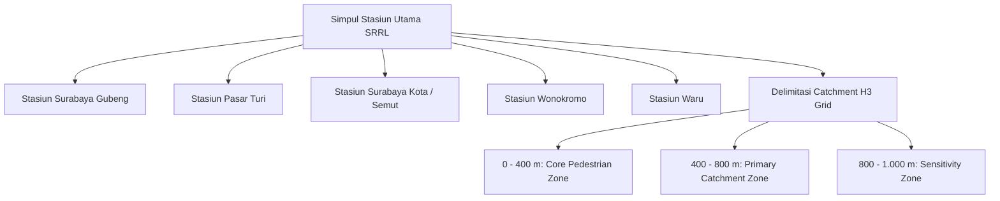
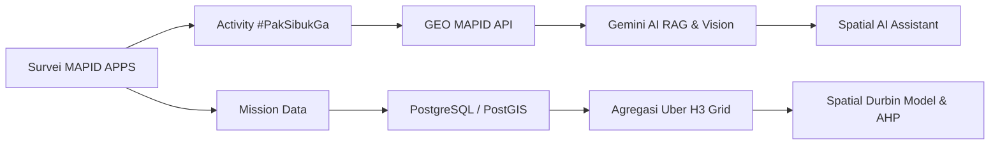

# Dokumen Rencana Survey Activities (Form A)
**MAPID WebGIS Competition 2026**

---

## I. IDENTITAS TIM & KETENTUAN HAK CIPTA TAGAR

| Parameter | Spesifikasi Rencana |
| :--- | :--- |
| **Nama Tim** | Pak, sibuk ga? |
| **Judul Proposal WebGIS** | *A WebGIS-Based Decision Support System for Assessing TOD Readiness and Its Association with Land Value in Surabaya* |
| **Tagar Resmi Survei (Hashtag)** | `#PakSibukGa` *(Wajib digunakan seragam pada setiap entri Community Maps)* |
| **Wilayah Studi Kasus** | Kawasan Metropolitan Surabaya (Koridor Transit SRRL & Feeder WiraWiri / Suroboyo Bus) |
| **Target Total Pengumpulan Data** | **360 Titik Spasial Valid** (100 Activity + 260 Mission Data) |

### Susunan Anggota Tim & Akun MAPID APPS

| No. | Nama Lengkap | Peran dalam Tim | Jurusan / Perguruan Tinggi | Username MAPID APPS |
| :---: | :--- | :--- | :--- | :--- |
| 1 | **Muhammad Zulfan Fakhriza Al Azmi** | Project Leader (Ketua Tim) | Perencanaan Wilayah & Kota ITS | `@zulfanfakhriza` |
| 2 | **Muhammad Mirza Wibisono** | Business & Product Analyst | Perencanaan Wilayah & Kota ITS | `@mirzawibisono` |
| 3 | **Hanaamira Pramesti** | Data & Spatial Analyst | Perencanaan Wilayah & Kota ITS | `@hanaamira` |
| 4 | **Rayhan Agnan Kusuma** | UI/UX Designer | Teknologi Informasi ITS | `@rayhanagnan` |
| 5 | **Rayka Dharma Pranandita** | AI & WebGIS Developer | Teknologi Informasi ITS | `@raykadharma` |

---

## II. FOKUS KORIDOR & ZONASI SPASIAL SURVEI

Survei difokuskan pada simpul transit kereta api regional **Surabaya Regional Railway Line (SRRL)** Gerbangkertasusila serta koridor angkutan penghubung (*feeder*) **WiraWiri Suroboyo** dan **Suroboyo Bus**.

---

## III. ALOKASI KUOTA DATA & PLAN SURVEI

### A. Data Activity (Community Maps) — WAJIB
* **Target Kuantitas**: **100 Titik Spasial Valid** (Insentif Maksimal Rp300.000).
* **Format Entri**: Judul, Narasi Cerita Pengguna, Foto/Video, Koordinat GPS, Hashtag `#PakSibukGa`.

| Kategori Activity | Target Titik | Parameter Lapangan yang Didokumentasikan | Peran & Relevansi dalam WebGIS & AI |
| :--- | :---: | :--- | :--- |
| **Pedestrian & Walkability** | 35 titik | Fisik trotoar, ketersediaan *ramp/tactile paving*, zebra cross, JPO, dan pencahayaan malam. | Variabel *Design* dalam pembobotan 5D TOD (AHP Score). |
| **Transit Integration & Multimodal** | 30 titik | Lokasi halte WiraWiri/Suroboyo Bus, pangkalan ojol/angkot, titik *drop-off*, fasilitas parkir sepeda. | Variabel *Destination Accessibility* & integrasi antarmoda. |
| **Hambatan Ruang & Disamenity** | 20 titik | Trotoar terganggu PKL meluber, parkir liar motor/mobil, titik genangan air/banjir, penyempitan jalur. | Variabel Kontrol Lingkungan (*Disamenity Factors*). |
| **User Experience & Dynamics** | 15 titik | Antrean bus/feeder jam sibuk, kepadatan ruang tunggu stasiun/halte, catatan kenyamanan pejalan kaki. | Data latih RAG Asisten Spasial AI (Google Gemini Chatbot). |

---

### B. Data Mission (Challenge Reguler MAPID) — OPSIONAL
Untuk memvalidasi model regresi nilai tanah (*Spatial Durbin Model*) dan proksi tingkat pengeluaran/daya beli lokal (*SES*):

1. **Properti Go**:
   * **Target**: **100 Titik Valid** (Target Insentif Rp50.000).
   * **Objek**: Properti dijual/disewakan (Rumah, Ruko, Kos, Tanah, Retail F&B) pada radius 0–1.000m simpul SRRL.
   * **Manfaat Model**: Validasi variabel terikat nilai tanah riil pasar terhadap perkiraan kenaikan nilai tanah (%ΔNJOP).
2. **Struk Go**:
   * **Target**: **60 Titik Valid** (2 x Ambang Batas 30 Titik = Target Insentif Rp100.000).
   * **Objek**: Struk belanja transaksi minimarket, F&B, dan transportasi di sekitar simpul transit (max 3 hari terakhir).
   * **Manfaat Model**: Indikator intensitas aktivitas ekonomi & daya beli lokal (*People Spending Proxy*).
3. **Menu Go**:
   * **Target**: **100 Titik Valid** (Target Insentif Rp50.000).
   * **Objek**: Warung, kaki lima, kafe, resto, kisaran harga menu per porsi, dan tingkat keramaian pembeli.
   * **Manfaat Model**: Pengukuran variabel *Diversity* (percampuran guna lahan dan skala harga usaha lokal).

---

## IV. JADWAL EKSEKUSI LAPANGAN (13 – 30 AGUSTUS 2026)

| Tanggal | Tahapan Kegiatan | Output & Target Tim |
| :--- | :--- | :--- |
| **13 – 15 Agustus** | • Penyusunan Form A & Pembagian Zona Lapangan. • Uji Coba Pengambilan Data (*Pilot Survey*) di Stasiun Gubeng. | Form A disubmit oleh Ketua Tim (`@zulfanfakhriza`). |
| **16 – 20 Agustus** | • Survei Lapangan Koridor Stasiun Gubeng & Stasiun Pasar Turi. • Pengambilan Data Activity & Mission (Properti/Struk/Menu Go). | 40 Titik Activity + 100 Titik Mission Terkumpul. |
| **21 – 24 Agustus** | • Survei Lapangan Koridor Stasiun Wonokromo, Waru, & Surabaya Kota. • Survei Jalur Feeder WiraWiri Suroboyo. | 40 Titik Activity + 100 Titik Mission Terkumpul. |
| **25 – 27 Agustus** | • Pengambilan Data Pelengkap & Penyisiran Titik Sensitivity Zone (800–1.000m). | 20 Titik Activity + 60 Titik Mission Terkumpul. |
| **28 – 29 Agustus** | • Quality Control (QC) & Data Cleaning via GEO MAPID REST API. • Verifikasi Titik bersama Koordinator Pendamping. | 100% Data Valid Siap Diumumkan. |
| **30 Agustus** | • **Submit Form B** oleh Ketua Tim (Maks 23:59 WIB). • **Submit Form C** oleh Masing-masing Surveyor Misi. | Rekapitulasi Klaim Insentif Final. |

---

## V. ALUR INTEGRASI DATA KE SISTEM WEBGIS & AI

1. **Pengayaan Asisten Spasial AI (Google Gemini)**:
   * Narasi entri *Activity* diekstraksi untuk membentuk basis pengetahuan RAG (*Retrieval-Augmented Generation*).
   * Asisten AI dapat memberikan insight kontekstual saat pengguna menanyakan kondisi fasilitas di antarmuka WebGIS.
2. **Kalkulasi TOD Readiness Score & Regresi Nilai Tanah**:
   * Data *Menu Go* & *Struk Go* dihitung ke dalam sel grid H3 untuk mengukur skor keragaman fungsi kawasan (*Diversity*).
   * Data *Properti Go* menjadi variabel independen penguji model estimasi kenaikan nilai tanah (%ΔNJOP).

---

## VI. STANDARD OPERATING PROCEDURE (SOP) SURVEI LAPANGAN

1. **Format Penulisan Tagar**: Setia entri *Activity* wajib diakhiri dengan tagar `#PakSibukGa`.
2. **Standard Foto & Akurasi GPS**:
   * Foto diambil langsung di lokasi (*real-time camera*).
   * Memastikan sinyal GPS terkunci akurat (presisi < 5m) sebelum menyimpan data.
3. **Etika Privasi & Keamanan**:
   * Menyamarkan informasi sensitif (nama pribadi/nomor transaksi) pada foto Struk Go.
   * Survei dilakukan secara berpasangan pada siang/sore hari dengan mengutamakan keselamatan lalu lintas.
